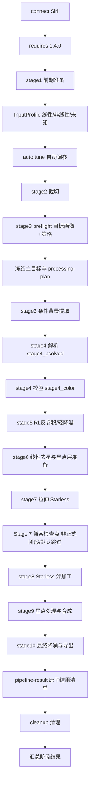

# `seestar_Superimpose.py` 流程与逻辑说明

本文档针对 [`seestar_Superimpose.py`](./seestar_Superimpose.py) 的当前实现，整理其入口流程、阶段职责、自动调参、回退策略和产物行为。目标是让后续维护时能快速判断某段逻辑位于哪一层、失败后会怎样降级、哪些文件会被读写。

本文档是 pipeline 阶段逻辑、参数和产物细节的单一来源；`README.md` 与 `INTEGRATION_README.md` 只保留面向用户或集成层的摘要和引用。

## 1. 脚本定位

该脚本是 Seestar 后期处理的单一真源，运行前提是：

- 在 Siril Python 环境中执行，依赖 `numpy` 与 `sirilpy`
- Siril 版本至少为 1.4.0
- 工作目录中存在 `.fit/.fits` 输入
- SyQon-Starless / SASP Dark Star 可用时可执行去星；不可用或结果被拒绝时保留含星复核路径，不会把 passthrough 伪装成 Starless
- 可选插件（SetiAstroSuitePro、CosmicClarity、VeraLux 等）可用时提供增强处理路径

脚本职责不是做 GUI 调度或打包，而是在 Siril 已连接、工作目录已确定的前提下，完成一轮从输入 FITS 到最终 TIFF / PNG / FITS 导出的 Stage 1-10 处理流水线。已停用的后续实验模块保留源码，但不由正式入口加载或执行。

## 2. 总体执行顺序

入口在 `SeestarPostProcessor.run()`，真实执行顺序如下：



其中：

- 正式产品阶段编号固定为 Stage 1-10；遗留实验类型不属于产品阶段契约
- 阶段 1-6 视为线性阶段，目标画像与 policy 选择合并到 Stage 3/4 preflight，不再单独占一个阶段；`stage2_5_target_profiler()` 仅是兼容别名
- 阶段 6 是线性去星与星点层准备，先在线性图上分离星点；阶段 7 再拉伸 starless，避免拉伸放大的脏背景进入去星模型
- 主类正式入口为 `stage6_star_separation()` / `stage7_stretching()`，分别调用 `run_stage6_star_separation()` / `run_stage7_stretching()`；旧名称仅为兼容别名
- 因此阶段 7-10 是 starless-first 非线性核心处理
- 默认 starless-first 路径下只记录一个 Stage 7 兼容检查点（非正式阶段）；旧的去星前质量门控仍保留给非默认/调试路径，`stage6_5_pre_starless_gate()` 仅是兼容别名
- 在线 AI 必须同时满足 `SEESTAR_NETWORK_MODE=1`、阶段开关和凭据；模型只选择代码定义的候选 ID，不能提供自由数值。Stage 7 只把本地硬门已通过的非救援候选暴露给模型，未知/不可用 ID 回退确定性本地择优
- 自动调参发生在阶段 1 完成之后、阶段 2 开始之前
- 脚本不会因为单个非致命阶段失败就立刻退出，而是尽量记录 `ok / degraded / failed / skipped` 后继续处理
- GUI 新任务通过 `task-manifest.json` 与每轮 `runs/<run-id>/run-manifest.json` 传入只读来源。单个 FITS/FTS/XISF 或复核图由 Stage 1 从原路径加载后只在运行目录保存 `working.fit`；XISF 不回写来源。Light 使用清单中的精确分组引用进入既有 debayer/register/stack 链，不再扫描来源目录决定本轮文件。没有任务清单的旧 CLI 运行仍保留顶层 FITS 扫描兼容路径。
- 跨运行正式续跑点只允许 Stage 1、2、5。每个点在输入状态确认为线性且阶段结果为 `ok/degraded` 后、普通中间文件清理前，原子发布到任务级 `checkpoints/`；`checkpoint-manifest.json` 同时记录阶段契约、累计配置指纹、来源指纹和产物 SHA-256。
- 当 `SEESTAR_INPUT_MODE=stage1_prepared_resume` 时，加载已验签的 `stage1_prepared.fit`，从 Stage 2 继续。GUI 不允许手动选择该模式。
- 当 `SEESTAR_INPUT_MODE=stage2_corrected_resume` 时，会使用工作目录根下或旧 `process/` 下的 `stage2_corrected.fit` 作为已完成裁切/视场修正的叠加后中间结果：
  `prepare stage2_corrected.fit -> auto tune -> stage3 background -> stage4 color -> stage5 linear -> stage6 starless -> stage7 stretch -> compatibility checkpoint skipped -> stage8 -> stage9 -> stage10 -> cleanup`。
  同时把阶段 1 记录为 `skipped`，阶段 2 记录为加载既有中间结果；只有 checkpoint SHA-256 与可信 `pipeline-result.json` 匹配或当前证据独立确认线性时才进入 Stage 3-9
- 当 `SEESTAR_INPUT_MODE=result_linear_resume` 时，会改走显式续跑分支：
  `prepare result_linear.fit -> auto tune -> target preflight -> stage6 starless -> stage7 stretch -> compatibility checkpoint skipped -> stage8 -> stage9 -> stage10 -> cleanup`。
  同时把阶段 2、3、4、5 记录为 `skipped`；未经 provenance 验证或线性证据冲突时不会仅凭文件名信任该断点
- 任一输入解析为 `nonlinear` 或 `unknown` 时，Stage 3-9 均跳过，Stage 10 只导出 `result_review*`

### 2.1 实际天文后期逻辑总览

当前代码不是按“先拉伸整图再去星”的旧顺序运行，而是先在较干净的线性图上拆出 starless/starmask，再只拉伸 starless 主体，最后受控回星。

| 流程层 | 代码阶段 / 检查点 | 天文后期目的 | 实际处理逻辑 |
|---|---|---|---|
| 输入统一 | Stage 1 / `working.fit`、`stage1_prepared.fit` | 得到一张可处理的线性 FITS | 新任务严格读取运行清单：明确母版只读加载，XISF 转为任务内 FITS；Light 只使用冻结分组并执行 debayer、register、stack。无清单旧 CLI 才使用顶层 FITS 兼容扫描 |
| 画面边界 | Stage 2 / `stage2_corrected.fit` | 去掉黑边和窄幅彩色边缘，避免污染背景建模和去星 | 自动扫描四边近黑/暗边界/红蓝叠加伪影并独立裁切，再按 `edge_black_ratio` 迭代复检 |
| 输入契约 | Stage 1/续跑 preflight / `processing-plan.json` | 阻止未知或已拉伸图像进入破坏性线性算法 | 用 FITS metadata、像素统计与可信 checkpoint provenance 得到 `linear / nonlinear / unknown`；文件名/扩展名不算证据，计划在变换前原子冻结 |
| 目标策略 | Stage 3/4 preflight / `target_profile.json`、`pipeline_policy.json` | 根据目标类型保护真实星云、暗云气、星系核心或星团星色 | 只冻结一个 primary target 驱动 policy；Stage 4 可追加 `bright_core` 等 secondary labels，但不能改变主路由 |
| 线性校正 | Stage 3-5 / `stage3_bgremoved.fit`、`stage4_color.fit`、`stage5_linear.fit` | 在线性域完成背景、校色、可选反卷积和轻降噪 | Stage 3 按过程证据作 `preserve / review_required / apply` 决策并以不可变基线事务执行候选；Stage 4 对宽带和确认 Ha/OIII 的双窄带优先执行单次 Gaia DR3 SPCC，宽带异常时才做单次 PCC，双窄带 HOO 只作为隔离艺术派生；Stage 5 先 PSF/RL，再 post-RL denoise |
| 线性去星 | Stage 6 / `stage6_starless.fit`、`starmask_raw.fit`、`starmask_clean.fit` | 在噪声未被非线性放大前拆出主体和星点层 | 固定用最终可用线性检查点做 SyQon；质量重试复用同一线性输入；结果显式为 `accepted / target_bypass / rejected / tool_failed`，后两者只保留含星复核路径 |
| 主体拉伸 | Stage 7 / `stage7_stretched.fit` | 把 starless 主体拉到可视亮度，同时避免黑场压死和核心过曝 | 本地生成候选并先执行全部硬门；AI 如启用只能在已通过硬门的 `stage7_cand_a/b` ID 中选择，确定性色度救援候选不暴露给模型；无效选择回退本地质量排序 |
| Starless 增强 | Stage 8 / `stage8_enhanced.fit`、`starless_enhanced.fit` | 分区提升星云主体和外围弱信号，保护背景与亮核 | 仅在 Stage 6 明确接受去星或目标保星旁路时进入相应路径；去星拒绝/失败时只保存含星复核检查点，不运行 Starless-only 增强 |
| 回星合成 | Stage 9 / `stage9_remixed.fit` | 把星点按质量诊断受控回混，避免二次星点、halo 或坏蒙版污染 | 从原始含星图建立独立星表并匹配 starmask；星点作为上层、Starless 作为底层执行受支持层约束的 Alpha+Screen，候选不通过 post-remix 门控时降强度重试或回滚无星底图 |
| 交付导出 | Stage 10 / `stage10_final.fit` | 生成可交付 TIFF/PNG/FITS | 正常路径按验收来源选择最终图；输入未知/非线性或缺少必需星点时只写 `result_review*`。背景决策需复核时保留像素并把全局结果标为 `review_required` |

### 2.2 InputProfile、处理计划与结果清单

- `InputProfile` 只使用 FITS metadata、像素统计和可信 checkpoint provenance，把输入解析为 `linear / nonlinear / unknown`；文件名、目录名和 `.fit/.fits` 扩展名不能单独证明线性状态。
- 只有 `state=linear` 且证据无冲突时 `safe_for_linear_steps=true`。其余状态只允许 Stage 2 安全裁切，之后跳过 Stage 3-9，并让 Stage 10 进入 review-only。
- 产品任务续跑同时核验 `task-manifest.json`、`checkpoint-manifest.json`、运行清单、Stage 1/2/5 契约、来源与配置累计指纹、线性状态和 checkpoint SHA-256。旧目录只读迁移必须再验证 `processing-plan.json` 哈希、`pipeline-result.json` 哈希与计划引用、checkpoint 线性状态和 SHA-256；验证后把该文件作为外部母版从 Stage 1 安全导入，不直接继承旧 Stage 5 契约。任一不匹配都不能用断点文件名绕过输入门。
- `processing-plan.json` 在处理变换前原子写入工作目录，并镜像到 `process/`。它冻结输入 SHA-256、InputProfile、唯一 primary target、secondary labels、通道语义、阶段动作、代码候选合约、脱敏配置和规范化 `plan_hash`。
- `pipeline-result.json` 在阶段结束后原子写入相同两个位置，引用 `plan_hash`，记录阶段结果、产物 SHA-256 和全局状态 `success / partial_success / review_required / failed`。日志输出 `[PIPELINE_RESULT] status=... manifest=...`，GUI 以此区分正常完成与需要复核。

### 2.3 GUI 最新阶段预览协议

阶段预览是只读观察链路，不参与候选选择、质量门控、阶段状态或最终导出：

- `_record_stage()` 同时写兼容事件 `[PIPELINE_STAGE_RESULT]` 和 JSON 事件 `[PIPELINE_STAGE_DETAIL]`。阶段显示状态只读取 `status / execution / fallback_used / upstream_passthrough / reason_code / components`，不再从人类可读 `message` 中搜索 `skipped`、`fallback` 等关键词。`fallback_used=true` 只表示本阶段实际采用回退路径；`upstream_passthrough=true` 表示使用上游安全旁路源，两者不会互相推导。仅当内部状态为 `ok` 或 `degraded` 时，才从该阶段已经验收并保存的最终产物生成预览。
- Stage 1-10 正常路径依次使用 `stage1_prepared`、`stage2_corrected`、`stage3_bgremoved`、`stage4_color`、`stage5_linear`、`stage6_starless`、`stage7_stretched`、`stage8_enhanced`、`stage9_remixed`、`stage10_final`；去星拒绝/失败时 Stage 6-8 改用明确的 `stage6_passthrough` / `stage7_review_with_stars` / `stage8_review_with_stars` 复核源。旧阶段别名只允许作为历史目录的只读候选，不再由新任务写出。
- 预览一律写为有界 16-bit RGB PNG。Stage 0 和 Stage 1-6 使用链接的屏幕显示拉伸：全通道共用黑/白参考和亮度增益，只改变 GUI 预览 PNG，绝不回写 FITS 或参与质量门控。Stage 7 以后显示阶段本身已有的非线性结果，不增加额外显示拉伸。
- 预览先写临时文件，再原子替换 `process/ui_preview/latest.png`。成功时输出 `[PIPELINE_PREVIEW] {"stage":...,"title":...,"status":"ready","payload":".../latest.png"}`；读取或写出失败时输出 `status=unavailable` 和轻量原因。
- `failed/skipped` 阶段不发布新预览。预览生成失败只记录警告，GUI 保留上一张可靠图像，不展开失败流程，也不改变该阶段的 `ok/degraded` 结果。
- Stage 0 不属于正式 pipeline 阶段，由 GUI 异步读取冻结输入：Light 使用首个分组样本，FITS/FTS 母版直接读取，产品任务使用已验证 checkpoint；XISF 在 Stage 1 转为 FITS 前可暂不显示 Stage 0 预览。不得再从目录中选择“最新 FITS”。

## 3. 核心对象分工

### 3.1 `PipelineConfig`

`PipelineConfig` 是全部可调参数的集中入口，主要分为几类：

- 重试控制：`max_retries`、`retry_delay`
- 阶段 1 质量门控：`stage1_register_fail_ratio_max`
- 裁切：`crop_margin`
- 背景提取：生产授权读取输入线性证据、source/coverage mask、真实天空空间覆盖、冻结留出背景/RMS、目标通量与形态保真；`bg_samples`、`bg_tolerance`、`bg_smooth` 仅生成候选参数。安全样点的目标/最小数量、patch 半径、亮度/纹理分位上限属于运行安全边界；旧 `bg_*_ratio` 与 `stage3_gradient/dirty_*` 字段只保留兼容和诊断，不再决定生产任务跳过、执行或候选硬拒绝。Polynomial→残差 RBF 仍有独立拟合/验证数量与复合降级约束；方向性噪声保持独立路由
- 线性降噪：`denoise_enabled`、`denoise_mod`、`denoise_safety_max`
- 拉伸：`asinh_stretch`、`asinh_offset`、`ghs_shadowsclip`、`ghs_stretchamount`，以及 `stage7_target_aware_stretch_enabled`、Stage 7 preview 标尺开关、两个 P50 目标比例、Asinh 强度上限和目标局部质量阈值
- 星云增强：`nebula_saturation`、`nebula_bg_factor`
- 星点混合：`star_intensity`、`stage9_fallback_intensity_levels`、兼容上限 `star_fallback_intensity`，以及混合星场单调多锚点曲线的弱/中/亮/极亮目标和预测覆盖上限（非混合场仍保留 Asinh 回退；`remix_safe_blend`、`remix_nebula_weight` 为旧配置兼容字段）
- 最终导出：`final_saturation`、`final_bg_factor`
- AI：`ai_post_enabled`、`ai_endpoint`、`ai_model`、`ai_api_key`、`ai_timeout_sec`、`ai_strength`、`ai_prompt`、`ai_advisor_mode`、`ai_stage6_enabled`、`ai_stage7_enabled`、`ai_stage8_enabled`
- AI 艺术衍生实验：`ai_artistic_derivative_enabled`、`ai_artistic_endpoint`、`ai_artistic_model`、`ai_artistic_api_key`、`ai_artistic_prompt`、`ai_artistic_timeout_sec`
- 停用实验兼容字段仍由 `PipelineConfig` 保留，但正式 `run()` 会强制关闭，不参与产品阶段决策
- 运行行为：`checkpoint_mode`、`debug_mode`、`auto_tune_enabled`、`auto_tune_debug`
- 工作流插件控制：`workflow_plugin_probe_enabled`（默认 `False`，仅在显式启用时探测插件命令）、`aberration_api_enabled`（默认 `False`，API 路径在 siril-cli 线程所有权场景下可能失败）、`optional_color_transform_enabled`（默认 `False`，启用时阶段 8/9 尝试可选调色插件）
- 输入过滤：`exclude_prefixes`、`exclude_suffixes`、`exclude_substrings`

脚本没有把参数散落在各阶段函数中，后续维护时应优先检查这里。

### 3.2 `ImageFeatures` / `AutoTuneResult`

这两个数据结构用于自动调参：

- `ImageFeatures` 保存背景、中值、星密度、星点尺寸、目标面积、亮核比例、边缘黑边比例等测量值
- `AutoTuneResult` 保存识别出的目标类型、修改过的参数列表和告警说明

### 3.3 `StageResult`

每个阶段结束后都会追加一条 `StageResult`，状态只允许是：

- `ok`：阶段成功完成
- `degraded`：阶段未完全成功，但主流程继续
- `failed`：该阶段核心目标失败
- `skipped`：阶段被显式跳过

注意：`failed` 并不自动等于整条流水线退出。当前实现更偏向"最大化导出结果"。

### 3.4 Target Profile / Pipeline Policy

Stage 3/4 preflight 会生成运行时目标画像和策略：

- `target_profile.json`：目标名称猜测、置信度、target type、风险标记和识别来源
- `pipeline_policy.json`：Stage 3-7 使用的背景、校色、线性处理、拉伸候选和兼容门控策略
- 内置策略来自 `policy_selector.py`，配置文件来自 `pipeline/configs/policies/*.yaml`
- 若 profiler、metadata 或自适应特征读取失败，会回退为 `generic_low_snr_safe`

目标画像识别不是独立 Stage 2.5，而是 Stage 3/4 内部 preflight，不记录到 stage summary。`stage2_5_target_profiler()` 仅为旧调用方保留，实际转发到 `target_profile_preflight()`。Stage 3 前会选择并冻结本轮唯一 `primary_target`，只有它能驱动 pipeline policy；冻结动作写入 `processing-plan.json`，处理过程中不得改路由。Stage 4 在 platesolve 后仍会刷新观测，但只允许合并 `bright_core / large_nebulosity / faint_outer_cloud / dense_star_field / reflection_blue / emission_red` secondary labels 和诊断证据。若新观测指向不同主目标，只记录 `observed_primary_target`，保留已冻结 primary 和原 policy。

### 3.5 `PipelineLogger`

`PipelineLogger` 只是一个轻量日志器，负责：

- 统一打印 `DEBUG / INFO / WARN / ERROR`
- 为每个阶段记录起止和耗时
- 为最终汇总提供足够可读的控制台输出

### 3.6 插件脚本基础设施

脚本提供了一套完整的插件脚本发现和执行体系：

- `_resolve_siril_scripts_root()`：从 `SEESTAR_SIRIL_PLUGIN_DIR` 环境变量指向的目录中定位 `siril-scripts` 根目录
- `_find_plugin_script()`：在 siril-scripts 根下按相对路径查找脚本文件
- `_validate_plugin_script_prerequisites()`：在执行前检查脚本所需的 Python 模块是否可用（如 `PyQt6`、`tiffile`、`astropy` 等），避免在离线环境中产生 traceback 噪声
- `_run_plugin_script_by_path()`：通过 Siril `pyscript` 命令在 Siril 进程内执行脚本
- `_run_plugin_script_cli_subprocess()`：以外部 Python 子进程调用脚本 CLI 模式（不走 Siril pyscript GUI 路径），支持超时控制和实时日志转发
- `_run_first_available_command()`：在多个候选命令中按顺序执行第一个可用命令；当 `workflow_plugin_probe_enabled=False` 且未设置 `allow_when_probe_disabled` 时直接跳过
- `_install_pyqt6_headless_stub()`：为 SASP Aberration API 等需要 PyQt6 的模块注入无头桩模块，使其在无 GUI 环境中可正常导入

已知脚本前置检查映射（`_SCRIPT_PREREQUISITE_MODULES`）：

| 脚本                         | 前置模块                           |
|------------------------------|-------------------------------------|
| `GraXpert-AI.py`             | `onnx`, `onnxruntime`, `appdirs`, `cv2`, `PyQt6` |
| `AutoBGE.py`                 | `cv2`, `scipy`, `PyQt6`             |
| `CosmicClarity_Sharpen.py`   | `PyQt6`, `tiffile`, `lz4`, `zstandard`, `exifread`, `cv2` |
| `CosmicClarity_Denoise.py`   | `PyQt6`, `tiffile`, `lz4`, `zstandard`, `exifread`, `cv2` |
| `SyQon-Starless.py`          | `PyQt6`, `PySide6`, `astropy`, `scipy` |

## 4. 自动调参逻辑

自动调参不是独立阶段，而是 `run()` 中插在 `stage1_preparation()` 与 `stage2_view_correction()` 之间的配置重写步骤。

### 4.1 输入来源

自动调参依赖当前已加载的图像像素数据和输入路径提示：

1. 先调用 `self.siril.get_image_pixeldata(preview=False)` 读取当前图像
2. 使用 `self.source_file` 作为文件名/目录上下文
3. 失败时直接回退到 `base_cfg`，不影响后续阶段继续执行

### 4.2 特征提取

`measure_image_features()` 会把图像归一化成 RGB 浮点数组，再提取：

- 背景亮度与波动：`bg_median`、`bg_std`
- 颜色倾向：`red_dominance`、`blue_dominance`
- 星场复杂度：`star_density`、`median_star_size`
- 目标覆盖特征：`object_area_ratio`、`diffuse_ratio`
- 高亮核心特征：`core_brightness_ratio`
- 黑边特征：`edge_black_ratio`

所有结果都会做安全限幅；如果测量异常，则整体回退为保守默认值。

### 4.3 目标识别顺序

`detect_target_type()` 分两层：

1. 先看路径和文件名关键词，例如 `m42`、`andromeda`、`jupiter`
2. 如果关键词无法命中，再按图像特征保守推断

支持的目标类型包括：

- `EMISSION_NEBULA`
- `REFLECTION_NEBULA`
- `GALAXY`
- `CLUSTER`
- `PLANETARY_NEBULA`
- `WIDEFIELD`
- `PLANETARY`
- `UNKNOWN`

### 4.4 调参顺序

`auto_tune_config()` 的处理链固定为：

1. 默认配置副本
2. 从测量特征归一化出 `noise/star/diffuse/core/edge/red/blue/object` 分数
3. 使用连续公式直接生成核心参数
4. 用 `clamp_config()` 做统一安全限幅

比较关键的调参倾向：

- 背景噪声高：增强 `denoise_mod`，并降低拉伸强度
- 星点密度高：降低 `star_intensity`
- 红色占优：降低 `nebula_saturation` / `final_saturation`
- 蓝色占优：适度提高 `nebula_saturation` / `final_saturation`
- 亮核比例高：提高 `asinh_offset`、收敛拉伸参数
- 边缘黑边明显：Stage 2 自动识别四边黑边和叠加伪影后裁切
- 主体覆盖面积大：降低 `bg_samples` 并提高 `bg_smooth`

`TargetType` 仍会识别并记录日志，但在当前版本中仅用于诊断说明，不再直接驱动 preset 套参。目录坐标、视觉特征和自动提示的选择过程写入 `target_profile.json -> diagnostics` 并按 INFO 输出；只有会影响策略可靠性的异常才进入 `warnings`。

### 4.5 强制运行时开关

自动调参完成后，`_apply_forced_runtime_switches()` 会检查 `SEESTAR_DENOISE_FORCE` 环境变量，允许在自动调参之后强制覆盖 `denoise_enabled` 的值。

自动调参失败时不会终止流程，只会恢复默认配置并记录告警。

## 5. 各阶段详细说明

### 5.1 阶段 1：前期准备

职责：创建干净的 `process/` 处理目录，并决定本轮输入来自"已叠加文件"还是 `Light_` 单帧。

处理逻辑：

- 先清理历史 `process_*` 目录
- 强制删除并重建 `process/`
- 一次遍历工作目录所有 `.fit/.fits`
- 根据前后缀、关键子串与 `exclude_substrings` 过滤中间产物，选出候选叠加图（例如 `sasp_*`、`*starless*`、`*starmask*` 会被跳过）
- 若存在候选叠加图，按修改时间降序选择最新文件
- 若没有叠加图但有 `Light_` 单帧，则转入预处理链
- 两类输入都没有时抛出 `SirilError`

预处理链只在 `Light_` 场景触发，顺序固定为：

```text
link -> calibrate -debayer -> register -2pass -> seqapplyreg -filter-round=2.5k -> stack -> mirrorx_single
```

这里会先把本轮 `Light_` 文件隔离到 `process/_light_input/`，统一命名为 `lightsrc_00001.fit` 这种格式，目的是避免历史序列和大小写差异干扰 Siril 的 `link` / `stack`。
叠加输出在本项目中固定为 `working.fit`，因此 vendor Seestar 脚本中的 `mirrorx_single result` 在这里对应为 `mirrorx_single working`。

注册质量门控：预处理结束后会统计配准成功/失败帧数。当失败比例超过 `stage1_register_fail_ratio_max`（默认 0.10）时，阶段记为 `degraded`。

阶段输出：

- `process/working.fit`
- `process/stage1_prepared.fit`
- `self.source_file`
- `self._stage1_input_mode`（`"stacked"` 或 `"light_preprocess"`）
- Siril 当前加载图像切换到 `working`

### 5.2 阶段 2：裁切

职责：在仍处于线性阶段时裁切边缘。

当前版本阶段 2 仅做裁切，不再包含 mirrorx 翻转或 platesolve 天文定位（platesolve 已移至阶段 4）。

裁切逻辑：

1. 获取当前图像像素和尺寸
2. 基于中心背景亮度估计黑边阈值，沿左/右/上/下扫描近黑像素比例、暗边界、红/蓝色偏叠加伪影，以及平滑后的边缘背景亮度台阶；每条边只使用与其正交的中央带评分，避免上下黑边污染全部列、左右黑边污染全部行。明确的近黑覆盖可单独触发，暗/亮台阶、色偏等软异常至少需要两类证据同时出现，避免把真实暗星云、渐晕或贴边彩色信号直接裁掉
3. 按四条边独立计算裁切量并执行 `crop`，不再先按 `crop_margin` 做固定比例裁切
4. 所有首次、迭代和彩边裁切候选都先映射回原图坐标，并必须完整保留以原图中心为锚点的保护矩形；`stage2_center_protect_area_ratio` 默认 `0.70`，表示中心保护矩形至少覆盖原图 70% 面积。保护矩形会向外对齐到 Siril CFA 所需的偶数坐标/尺寸，避免实际保存时因自动取整跌破面积阈值；候选超出保护边界时只裁到安全边界，不直接采用检测出的激进矩形
5. 测量 `edge_black_ratio`，若仍高于阶段 2 目标阈值，会继续在阶段 2 内复用自动边缘识别迭代补裁并保存到 `stage2_corrected.fit`；达到中心保护边界后停止继续蚕食视场并标记 `degraded`，后续阶段只诊断黑边，不再临时裁切去星输入
6. 若黑边裁切后阶段仍正常，会再次比较边缘窄条与中心区域的色偏/chroma 分数；当左/右/上/下边缘存在明显红蓝彩色伪影时，最多裁掉每侧约 2.5% 的窄边，并拒绝会让宽高损失超过 10% 的彩色边缘裁切；该候选同样受中心面积保护约束

回退逻辑：

- 裁切失败时阶段记为 `degraded`
- 无法获取图像尺寸或图像太小时跳过裁切
- 剩余坏边已经进入中心保护区时，不再继续裁切，保留至少默认 70% 的中心面积并将阶段记为 `degraded`，交由后续质量报告提示复核
- 彩色边缘裁切命令失败时阶段记为 `degraded`；检测异常只记录跳过，不阻断流程

阶段检查点：`stage2_corrected.fit`

阶段额外产物：

- `stage2_crop_report.json`：记录原始尺寸、最终尺寸、中心保护矩形、每次请求/实际采用的 `crop` 参数、保护门命中记录，以及相对原始图像累计裁掉的左/上/右/下像素；Stage 4 会读取该运行时记录用于说明解析图像已经是裁切后的视场

### 5.2.5 Stage 3/4 preflight：目标画像识别与策略选择

职责：在背景提取前识别并冻结唯一主目标，选择后续阶段的保守处理策略；Stage 4 解析后再用 `stage4_psolved.fit` metadata 补充观测和 secondary labels，但不能改变主路由。

输入来源：

- 当前已裁切 FITS 像素特征
- `stage2_corrected` 或源文件 FITS header metadata
- 路径、工作目录和文件名上下文
- 自动调参识别出的旧版 `TargetType` hint
- `pipeline/configs/target_catalog/popular_dso.json` 中的常见目标坐标、别名、特征和默认 policy

处理逻辑：

1. 使用自适应图像特征构建 profile
2. 用 FITS metadata 的坐标与目标库匹配；大目标会使用更宽的视场容差，避免 Horsehead/IC 434 这类构图中心偏离目标质心的场景被误判
3. 结合 feature flags 做二次加权；`dark_nebula` 和 `low_contrast` 会映射到弱外围云气特征
4. 按 `primary_target` 选择 policy，并同步到运行时 `self.target_profile` / `self.pipeline_policy`
5. 在任何处理变换前冻结 primary；后续刷新只能增加 secondary labels 和 `observed_primary_target` 诊断
6. 写出 `target_profile.json`、`pipeline_policy.json`，可用时额外写出 `stage3_target_preview.png`

回退逻辑：

- profiler 依赖不可用、像素读取失败、metadata 异常或 policy 选择异常时，记录到 Stage 3/4 message，不再新增独立 degraded 阶段
- 回退 profile 使用 `generic_low_snr_safe`，后续阶段继续执行

阶段额外产物：

- `target_profile.json`
- `pipeline_policy.json`
- `stage3_target_preview.png`（可选）

### 5.3 阶段 3：背景提取

职责：用可审计过程证据判断背景机制，只在证实为加性低频梯度时执行减法；固定经验分数不再决定生产任务是否跳过。

执行顺序：

1. 保存不可变输入基线 `stage3_bg_input`，并从 `InputProfile` 确认数据仍为线性。线性状态未知或冲突时 fail closed，保留像素并要求复核
2. 在基线像素上建立显式 `source_mask` 与 `coverage_mask`。源掩膜来自迭代低阶天空面、正残差、恒星高频峰和连贯扩展结构并向外生长；coverage mask 只表示非有限值或重复无数据底值，不把普通暗天空当成无覆盖
3. 仅从未被上述掩膜污染、有限、非裁剪、低纹理且局部无星峰的 patch 中选择真实天空样点。固定规则网格先冻结低频背景面以及亮度、纹理、星峰阈值；非弥散、`usable_sky_fraction >= 0.50` 且 `source_mask_fraction <= 0.50` 的场景可从每个网格种子执行确定性的受掩膜暗斑搜索，补充网格间候选。搜索不重新计算或放宽阈值，最终所有点统一去重并执行全局最小间距；相邻 4×4 网格边界也不能产生近重复证据。目标策略认定弥散/暗弱结构，或掩膜表明真实天空受限时禁用增强。当前至少 16 点、3 个象限、8/16 已选网格和横纵 55% 跨度是运行安全下限，不解释为行业通用天文阈值
4. 样点在任何执行决策前确定性拆为拟合集和冻结留出集；默认目标 40 点时通常为 30/10，最低为 24/8。留出点绝不安装到 Siril，也不参与 Polynomial/RBF 拟合
5. 在全部已审计天空 patch 上比较一阶方向平面和径向模型，并以 patch 中值的三倍采样不确定度判断空间变化是否可测；不确定度取逐像素下界与非重叠分块中位数估计的较大值，避免把去马赛克、注册重采样或降噪后的相关像素误当作独立样本：
   - `additive_low_frequency_gradient`：空间变化显著且非径向暗角，允许减法候选
   - `multiplicative_vignetting_or_flat_error`：中心到边缘的径向衰减得到明显更优支持，禁止加性扣除并路由到 master-flat/标定复核
   - `directional_pattern_or_walking_noise`：条带或 walking noise 不交给天空模型，路由到 bias/dark、采集抖动或重叠加复核
   - `target_signal_or_sky_limited`：目标填满视场或真实天空覆盖不足，保留基线并要求复核
   - `no_measurable_low_frequency_gradient`：留出天空变化未超过采样不确定度，原样保存为 `stage3_bgremoved.fit`
6. 只有“线性 + 真实天空覆盖充分 + 加性空间变化显著 + 无机制冲突”才得到 `apply`。`gradient_score / dirty_background_score` 仍写报告供诊断和旧调用方兼容，但不参与生产 `preserve / apply / review_required` 授权
7. 模型复杂度由目标和天空支持限制：大星系、弥散/暗弱结构、暗星云或天空覆盖受限时，一阶 `subsky 1 -existing` 排在首位并成为复杂度上限；普通场景才允许继续评估经验证的 RBF
8. 每个内置候选前调用 `set_image_bgsamples(..., recalculate=True)`，再读取 Siril 的实际样点。允许 Siril 丢弃个别无法重算的点，但所有返回坐标必须属于原拟合集，且实际集合仍满足最低数量和空间覆盖；否则 fail closed。所有 `subsky` 命令固定带 `-existing`，绝不退回 Siril 自动样点
9. 单候选必须在冻结留出 patch 上把 `P90-P10` 空间跨度改善到超过 before/after 联合三倍相关性保守采样不确定度，且背景 patch RMS 不得在同一不确定度之外变差；这取代固定 gradient/dirty 分数门
10. 目标保真使用同一冻结留出点分别拟合 before/after 一阶天空面，并在固定的处理前目标 mask 上测量背景参考通量、形态相关性、质心位移和目标区变化残差。背景参考通量损失超过 `3σ` 时拒绝；受一阶复杂度限制的场景若目标区新增结构超过留出天空不确定度 `3σ` 也拒绝。原始星云绝对均值变化仅保留兼容诊断，不再作为硬门
11. 候选还会重测方向性噪声；新增或显著放大条带/walking-noise 时拒绝。旧 `bg_std`、颜色和背景评分只用于候选排序、显示与旧调用方兼容，不得覆盖留出/保真拒绝结论；背景评分同时归档 dirty/gradient/chroma/std-growth/color-shift 分项、权重和加权结果
12. Polynomial→残差 RBF 复合候选仍是后备：至少 32 个已审计样点且目标保护允许，最佳单候选的冻结留出天空仍必须存在高于 `3σ` 的残余空间变化；两次变换都从不可变基线事务执行，并复用同一拟合/留出划分
13. 内置候选不可用或全部被过程门拒绝后，才按 `GraXpert/GXP -> GraXpert-BGE -> ADBE -> DBE -> AutoBGE -> NOX -> VeraLux NOX` 尝试外部回退。当前 Siril 1.4.4 没有原生 sample-free `subsky -auto`，所以项目不把它伪装成主流程；已有 `AutoBGE.py` 仅作为降级候选，仍必须通过相同留出背景/RMS与目标保真门
14. 候选执行是事务性的：每次候选前重载 `stage3_bg_input`；命令失败、空跑、样点审计失败、验证拒绝、切换下一候选或最终未选中均回滚基线。基线不能可靠恢复时立即停止搜索
15. 最终候选重载并保存为 `stage3_bgremoved` 后，再对当前 Siril 像素缓冲执行一次同一冻结留出集的背景跨度/RMS `3σ` 硬门。复验失败时覆盖回不可变基线并转 `review_required/degraded`；若基线无法恢复则停止流水线。只有旧兼容调用方没有 `InputProfile` 时不强制该复验
16. 最终 `dirty/std_growth` 经验一致性检查不替代统计硬门：触发时保留已经通过 `3σ` 的候选，但将阶段标为 `review_required/degraded`，避免仅凭经验分数把显著改善结果回滚
17. 所有证据写入 v3 `background_quality_report.json`：除原有 `process_evidence`、样点/掩膜、候选门禁、回滚事件和最终模型外，还写入 `algorithm_contract_version`、实际 `decision_thresholds`、背景分数分项、`final_output_validation` 和统计选优影子报告。`processing-plan.json` 的 `software` 段同时冻结 App 构建、pipeline contract、Stage 3 算法版本及三个核心源码文件的 SHA-256

RBF 参数变体仍以 `bg_samples / bg_tolerance / bg_smooth` 和噪声、星密度、目标覆盖生成，但它们只定义待验证候选，不构成执行事实。生产候选排名仍使用现有 `sufficient + background_score`，任何排名分数都不能让未通过留出天空或目标保真的候选进入最终输出。报告会额外计算以“残余跨度显著性 + 目标保真惩罚 + 方向性噪声惩罚”为准的 Pareto/dense-rank 影子顺序；它只用于真实数据比较，不影响本轮最终选择。

阶段检查点：`stage3_bgremoved.fit`；Debug/保留中间产物时还可检查 `stage3_candidate_*.fit` 与复合事务中间结果 `stage3_compound_poly_intermediate.fit`

### 5.4 阶段 4：图像解析 + 色彩校准

职责：执行天文定位（platesolve）并完成线性阶段的色彩平衡。

当前版本阶段 4 的物理主链为 `stage3_bgremoved.fit -> stage4_psolved.fit -> stage4_pre_pcc.fit -> stage4_spcc_candidate.fit -> stage4_color.fit`。`stage4_pre_pcc.fit` 保留旧兼容名，但语义是 SPCC/PCC 共用的不可变 `pre_color` 线性回滚源。任何 SPCC/PCC 超时、失败或质量门拒绝都必须先回到它，禁止把一个校色候选的像素串入下一候选。双窄带接受的物理结果另存 `stage4_physical_color.fit`；HOO 映射只生成隔离的 `stage4_hoo_artistic.fit`，随后恢复物理母版再写 `stage4_color.fit`。设备几何会从 FITS 焦距、像元、binning、设备身份和当前图像尺寸生成 `device_geometry_report.json`：无冲突且置信度达到门限时可驱动 platesolve，显式 `SEESTAR_STAGE4_PLATESOLVE_FOCAL/PIXELSIZE` 覆盖始终优先；解算后 WCS 像素比例超限即回滚并禁止 SPCC/PCC。`-noflip` 始终保留用户原始构图方向。

顺序：

1. `load stage3_bgremoved`
2. 基于当前裁切后图像记录 Stage 4 运行几何和 Stage 2 累计裁边；按显式环境覆盖 -> 无冲突高置信 FITS/设备证据 -> 旧默认值确定本轮 focal/pixel size，并记录预测像素比例和裁切后视场
3. 默认使用 Gaia 星表做一次解析：`platesolve -noflip -focal=<active> -pixelsize=<active> -catalog=gaia -order=3`；如需多星表候选，可通过 `SEESTAR_STAGE4_PLATESOLVE_CATALOGS` 显式覆盖
4. 若普通解析候选全部失败且 FITS header 有 `RA/DEC`、`OBJCTRA/OBJCTDEC` 或 `CRVAL1/CRVAL2`，会追加一轮 header-center platesolve 候选：`platesolve <ra>,<dec> -noflip -focal=160 -pixelsize=2.90 -catalog=<catalog> -order=3`；可通过 `SEESTAR_STAGE4_PLATESOLVE_HEADER_RADIUS` 额外传入 `-radius=...`
5. `save stage4_psolved`；若启用了自动几何，立即用 WCS `SECPIX/PIXSCALE/CD/CDELT` 复核预测像素比例，偏差超过门限时恢复 `stage3_bgremoved`、重写 `stage4_psolved` 并禁止 SPCC/PCC
6. Stage4 preflight 用解析 metadata 更新 `target_profile.json` 观测；已冻结 primary 和 policy 不变，新识别结果只进入 secondary labels 或 `observed_primary_target`
7. 从 FITS `OBJECT`、坐标和目标目录补充画像；例如 `OBJECT=M 42` 可增加亮核、发射红等保护证据，但不能在处理中途把主路由切换为另一 policy
8. 把通道语义规范化为 `broadband / narrowband / mono / nonlinear / unknown`：Mono 正常跳过；非线性保色跳过；语义未知保色并标记 `review_required`；高置信度 Ha/OIII 双窄带进入窄带 SPCC。只有 `broadband` 允许后续全局饱和度/颜色变换
9. 保存不可变 `stage4_pre_pcc.fit`（报告别名 `pre_color`）
10. 对确认线性的宽带 RGB/OSC 和双窄带都优先通过独立 `siril-cli` 执行一次 Gaia DR3 SPCC。本地 `siril_cat1_healpix8_xpsamp_*.dat` 分块有效时使用 `spcc -catalog=localgaia`，否则仅在 `SEESTAR_NETWORK_MODE=1` 时使用 `spcc -catalog=gaia`；默认超时 180 秒，不重试、不在一次方法内切换 catalog
11. 宽带 SPCC 传入 `Sony IMX585`、按 FITS/用户滤镜提示选择的 `ZWO Seestar LP` 或 `No filter`、`Average Spiral Galaxy` 白参考和极限星等。双窄带使用 `-narrowband`，默认传入 R/Ha `656.28 nm / 20 nm`、G/B OIII `500.70 nm / 30 nm`；G/B 波长与带宽保持相同，且 Ha/OIII 映射置信度不足时不猜测
12. SPCC 候选经过目标感知物理色彩质量门：检查有限值、通道相对增益、背景综合色偏、高光裁剪增长、动态范围漂移、恒星综合色温分布、背景归一化色差与主体颜色漂移。Siril 报告 `imprecise solution` 时把 `spcc_imprecise_solution` 写入 attempt/quality report，并强制交由上述像素门裁决，而不在测量候选前仅按日志字符串拒绝；像素门不通过仍按普通 SPCC 拒绝回滚。M42/发射星云允许真实红色主体占优
13. SPCC 异常或拒绝时先重新载入 `stage4_pre_pcc.fit`。只有宽带允许通过另一个独立 `siril-cli` 执行一次 Gaia PCC 异常回退；本地 `siril_cat_healpix8_astro.dat` 有效时优先 `pcc -catalog=localgaia`，否则仅在联网总闸开启时使用在线 Gaia。PCC 候选使用同一物理色彩质量门，且不得继承 SPCC 候选像素
14. 宽带 SPCC/PCC 都失败时，再从不可变检查点尝试恒星软遮罩局部色彩恢复。增益只作用于恒星及星翼，禁止手工全图白平衡和全图背景中性化；无论局部恢复成功或保色，都标记 `requires_review`
15. 双窄带禁止使用宽带 PCC。SPCC 接受时保存 `stage4_physical_color.fit`；SPCC 不可用时保存当前物理保色基线并标记 `requires_review`
16. HOO 艺术映射只从 `stage4_physical_color.fit` 创建独立派生事务：内部仍用 `stage4_pre_nbn.fit -> stage4_nbn_candidate.fit` 做亮度、背景、Ha/OIII 比例、星色和裁剪质量门，接受后另存 `stage4_hoo_artistic.fit`。报告固定 `role=artistic_derivative`、`feeds_main_pipeline=false`
17. HOO 派生无论接受、拒绝或保存失败，都重新加载 `stage4_physical_color.fit`；只有物理分支进入 `save stage4_color`。旧 `stage4_colorbalanced.fit` 仅供历史目录只读迁移
18. `color_calibration_report.requires_review=true` 时设置全局 `_stage4_color_review_required`；`pipeline-result.json.status=review_required`，Stage 10 只导出 `result_review*`，不写普通 `result_processed/result_final`

双窄带 SPCC 的物理结果是基于 OSC Bayer 响应和标称 Ha/OIII 通带得到的 HOO 真彩近似，不等同于单色相机独立窄带通道的精确光谱分离；SHO 属于人为映射，不进入 Stage 4 物理主路由。`stage4_hoo_artistic.fit` 仅是从物理母版生成的展示派生，不能反向替代 `stage4_physical_color.fit`。

SPCC/PCC 运行时保护：

- `SEESTAR_STAGE4_PLATESOLVE_ENABLE=0` 可关闭 platesolve；默认开启
- `SEESTAR_STAGE4_PLATESOLVE_CATALOGS` 调整解析星表候选顺序；默认 `gaia`
- `SEESTAR_STAGE4_FILTER_HINT` 仅在 FITS `FILTER` 缺失时补充 `broadband` 或 `dualband Ha OIII` 等通道语义，不直接套用固定调色矩阵
- `SEESTAR_SPCC_ENABLE` 默认开启；`SEESTAR_STAGE4_SPCC_TIMEOUT_SEC` 与 `SEESTAR_STAGE4_PCC_TIMEOUT_SEC` 都默认 180，运行时安全限幅 5–180 秒
- `SEESTAR_STAGE4_SPCC_OSC_SENSOR/OSC_FILTER/WHITE_REF/LIMITMAG` 覆盖宽带 SPCC 元数据；`SEESTAR_STAGE4_SPCC_NB_{R,G,B}_{WAVELENGTH,BANDWIDTH}_NM` 覆盖双窄带物理参数
- SPCC/PCC 都使用各自的一次性独立 Siril 进程作为可终止边界；GUI 注入 `SEESTAR_SIRIL_CLI`、两类 Gaia 目录和本轮临时配置路径。找不到独立 CLI 时按该方法单次失败处理，不在主连接中执行无界测光校色
- GUI 每轮按 manifest/SHA-256 把固定 SPCC 传感器/滤镜/白参考种子同步到隔离 Siril HOME；种子失效时启动前禁用 SPCC。App 不启用 Siril 在线 SPCC repository，不在运行中下载元数据
- GUI “下载离线 Gaia 解析/PCC 目录”只安装约 1.52 GB 的 astrometric/Teff 数据，不是约 21 GB 的 SPCC `xp_sampled` 光谱目录。两类 Gaia 目录都不写项目，构建验证禁止打包
- 通用 `cmd_with_check` 把 `spcc` / `pcc` 视为非幂等命令；Stage 4 的独立进程边界也固定 `max_attempts=1`

回退逻辑：

- `platesolve_ok=False` 时不调用 SPCC/PCC；宽带从 `stage4_pre_pcc` 做局部恒星回退，双窄带保留物理基线
- SPCC/PCC 成功但质量门拒绝与命令失败使用同一不可变回滚路径
- SPCC 成功后不调用 PCC；PCC 成功回退记录 `fallback_used=true`，但不因回退本身误报 `requires_review`
- 宽带两种测光方法都失败后的局部回退或保色、以及双窄带物理 SPCC 失败，都写入 `requires_review=true`，阶段状态为 `degraded`
- Mono 与非线性属于策略跳过，不把“未运行 SPCC/PCC”误报为失败
- `device_geometry_report.json` 记录候选来源、binning、有效像元、预测像素比例/视场、冲突、运行时激活和 WCS 复核；仅 `active_guarded + applied=true` 才能改变本轮 platesolve
- `stage4_narrowband_normalization.json` 记录隔离 HOO 派生的 Ha/OIII 映射证据、通道增益、线比例/星色/背景/亮度门、物理 parent 和 `feeds_main_pipeline=false`
- `color_calibration_report.json` 分开记录 `spcc` 主物理校色、`pcc` 宽带异常回退、`physical_color` 与 `artistic_hoo`；SPCC 段额外保存实际 `limit_magnitude`、固定元数据 source commit，以及本轮选中 sensor/filter/white-reference 文件的 SHA-256，并保留每种方法的单次 attempts、质量门、rollback、局部软遮罩覆盖率和 `requires_review`

阶段检查点：`stage4_psolved.fit`、`stage4_pre_pcc.fit`、可选 `stage4_spcc_candidate.fit` / `stage4_pcc_candidate.fit`、双窄带 `stage4_physical_color.fit` / `stage4_hoo_artistic.fit`（艺术分支内部使用 `stage4_pre_nbn.fit` / `stage4_nbn_candidate.fit`）、`stage4_color.fit`。旧 `stage4_colorbalanced.fit` 只读兼容

### 5.5 阶段 5：线性反卷积 / 轻降噪

职责：在线性图像上优先执行本地 GraXpert Object Deconvolution；模型或脚本不可用、执行失败/空跑时用未降噪星点建立 PSF 并执行受控 Siril RL 回退，再做轻量线性降噪，为后续线性去星提供保留微反差且背景不过度放大的输入。

逻辑要点：

- 输入固定优先 `stage4_color.fit`，阶段开始保存 `stage5_input_linear.fit`
- 首选 GraXpert 链路：GUI 依次检测 Seestar 随包模型、本机 GraXpert 应用已安装模型，再读取 `SEESTAR_GRAXPERT_OBJECT_MODEL_PATH` 提供的外部 `model.onnx`、语义版本目录或模型家族目录；有效模型会只读链接到隔离 HOME 的 `deconvolution-object-ai-models/<version>/model.onnx`。版本目录必须使用官方语义格式（例如 `1.0.1`）。随后调用 `GraXpert-AI.py -deconv_obj -strength 0.30 -psfsize 5.0 -model <version>`；`SEESTAR_GRAXPERT_GPU=1` 时传入 `-gpu`，由 ONNX Runtime 自动选择可用 provider 并在失败时回退 CPU，设为 `0` 时传入 `-nogpu`。成功后保存 `stage5_graxpert_deconv.fit`
- GraXpert 不可用或失败时进入 Siril 内核回退：`findstar -maxstars=200` -> `makepsf stars -sym -ks=33 -savepsf=stage5_psf.fit` -> `rl -loadpsf=stage5_psf.fit -iters=8 -alpha=3000 -tv -gdstep=0.0005 -stop=0.001` -> `save stage5_deconv` -> `denoise -mod=0.50 -indep` -> `save stage5_linear`
- `result_linear.fit` 在 `stage5_linear` 保存后作为线性交付/旧 CLI 兼容文件导出；新 GUI 只使用任务级 `checkpoints/stage5_linear.fit` 及签名清单续跑，不依赖该文件名
- Stage5 不再默认执行全局锐化、unsharp 或星点矫正，避免在线性暗背景中提前放大彩噪、星环和 halo
- CosmicClarity Denoise 只作为 Siril 内置降噪失败后的回退，强度映射限制在 `0.20~0.30`；`chroma_first` 使用 `0.30`，`luma_chroma_balanced` 使用 `0.25`
- GraXpert 反卷积只映射到 Stage5，强度限制为 `0.20~0.40`；模型不随此链路在线下载，缺失时稳定降级到 Siril RL
- 若 GraXpert 或 RL 后背景指标明显变差，背景保护会丢弃反卷积结果，重新回到 `stage5_input_linear` 后再执行轻降噪；因此 `stage5_linear.fit` 始终是 Stage 5 的最终线性输出
- Stage 5 的阶段事件和 `stage5_linear_report.json.components` 分别记录 `deconvolution` 与 `denoise` 子状态。GraXpert 成功而降噪被低噪声策略、用户或配置关闭时，反卷积为 `applied`、降噪为 `skipped`，当前反卷积结果仍保存成最终 `stage5_linear.fit` 并交给 Stage 6；不会把“未降噪”误报成整个 Stage 5 跳过。

当前 Stage 5 不执行可选转色。`optional_color_transform_enabled=True` 的可选颜色插件只在 Stage 8/9 使用，避免在线性阶段提前改变窄带/双窄带颜色语义。

阶段检查点：`stage5_linear.fit` 是最终线性输出；可选 `stage5_graxpert_deconv.fit` 或 `stage5_deconv.fit` 是反卷积后、降噪前检查点。旧 `stage5_denoised.fit` 只读兼容，不再写出

阶段额外产物：`result_linear.fit`（位于工作目录根目录，默认不会被下一轮输入扫描命中；仅供旧 CLI 显式模式与签名旧目录迁移使用，新 GUI 续跑以任务级 `stage5_linear.fit` 为准）

诊断输出：

- `stage5_noise_model.json` 在 `stage5_input_linear.fit` 基线上以最长边不超过 1024 像素的确定性采样，记录低信号低梯度背景蒙版、亮度/色度噪声、通道协方差、各尺度 MAD 与信号—噪声曲线。
- 启用线性降噪时，首先从不可变 `stage5_pre_multiscale.fit` 生成噪声模型驱动的亮度/对立色度多尺度软阈值候选；仅在背景噪声下降、主体结构细节保留、高光扩散、背景中值与裁剪门同时通过时保存 `stage5_multiscale_candidate.fit`。低噪输入正常跳过；拒绝或异常时回滚后进入原 Siril/CosmicClarity 降噪链。
- `stage5_linear_report.json` 会记录处理顺序、输入/输出、多尺度候选事务、Siril 降噪参数、CosmicClarity 回退强度、GraXpert 模型/失败原因、最终反卷积方法、噪声模型副本与 `background_guard` 的 before/after 自适应背景指标。

### 5.6 阶段 6：去星与星点层准备

职责：调用去星工具生成去星图，并尽量构造一个可控的星点层。当前默认在阶段 7 拉伸前执行，优先使用 `stage5_linear.fit`；GraXpert/RL 反卷积检查点仅在最终线性输出缺失时作为回退；`result_linear.fit` 续跑时会使用续跑加载得到的线性检查点。收益是避免非线性拉伸把低频脏背景、色斑和噪声放大后再交给去星模型；副作用是星点层也来自线性图，后续阶段 9 需要通过星点拉伸/回混强度控制恢复星点亮度。

星点分离输入模式：

- Stage 6 直接使用 Stage 5 的最终线性结果；输入域在质量报告中明确记录为 `input_domain=linear`，不再提供外部预拉伸模式。
- 当前内置 SyQon 会在脚本内部对线性图执行临时、可逆的 IHS 预拉伸，并在输出前逆变换回线性域。因此主流程不再额外执行 Asinh 预拉伸，避免 SyQon 内部变换与 Stage 7 主体拉伸叠加。
- `SEESTAR_STAR_SEPARATION_MODE`、`SEESTAR_STAR_SEPARATION_FALLBACK_TO_MILD_PRESTRETCH` 与 `SEESTAR_MILD_PRESTRETCH_STRENGTH` 已退役且会被忽略，不会生成或选择任何外部预拉伸输入。
- 动态范围塌缩同时参考绝对峰值和峰值/背景比：极低背景下仍保留足够相对信号时不误报。若确认塌缩，只尝试切换 Zenith/Axiom 模型；不再仅修改 `tile_size`/`overlap` 重复运行同一模型。其他残星、halo 或黑洞问题仍可在同一线性 source 上调整参数补救。

目标感知旁路：当 target profile 为 `globular_cluster`、`open_cluster` 或 `reflection_nebula_cluster`（包括 M45 类星点主体）时，默认不调用 SyQon/SASP。Stage 6 会把线性输入作为保星检查点继续交给 Stage 7 拉伸，不生成 `starmask`；Stage 8 随后跳过 Starless 专用增强，Stage 9 因无星点层不再回混。可通过 `PipelineConfig.stage6_star_preserve_target_bypass_enabled=False` 显式关闭此保守旁路。

说明：阶段 6 只写 `stage6_starless.fit`、`stage6_starless_quality.json`；旧 `stage7_starless.fit`、`stage7_quality.json` 仅用于历史目录只读迁移，不能作为无清单续跑依据。

去星优先链：

1. `SyQon-Starless.py` CLI 子进程（默认 Zenith v1 模型，tile-size=512，overlap=64；`SEESTAR_SYQON_GPU=0` 时追加 `--no_gpu`；带超时与日志转发）
2. `SASP Dark Star`（命令探测）

SyQon 路径补充逻辑：

- 脚本执行成功后，会在 `process/` 中收集产物：先按 `starless_{stretched_name}` / `starless` 查找，再按 glob 兜底
- 若 SyQon 脚本未生成 starless 产物，视为失败并回退到 SASP Dark Star

正常路径（去星成功后）：

1. 保存 `starless.fit`
2. 优先手动构建线性星点层：`stage6_input - starless`，并立即保存不可变的 `starmask_raw.fit`
3. 手动失败时，从可能的 `starmask` / `*_stars` 文件中兜底查找
4. 再不行则扫描 `process/` 中最新的星点蒙版
5. 对 raw 星点层自身做多尺度清理：估计背景/MAD 噪声，分离紧致星点结构与低频弥散残差，只用统一标量权重修改 RGB，避免改变星色
6. 清理后验收紧致星核/星翼保留率和弥散残留；通过时另存 `starmask_clean.fit` 并令兼容别名 `starmask.fit` 指向 clean。首次 `diffuse_residual_ratio` 超过硬上限 `0.08`、但紧致星与小星保留门已通过时，只对低紧致度弥散像素执行一次最大强度 `0.50` 的平滑复清理并重新实测；仍超限才禁用当前候选的 starmask，不允许用受污染的 raw 继续回星。紧致结构保留不足时直接回滚 raw，任何清理都不得覆盖 `starmask_raw.fit`
7. 导出 SASP 交换文件（`sasp_starless_input.fit`、`sasp_starmask_input.fit`）

星点层清理不再根据主体图的亮区直接判定“星云污染”，因此不会因为星点位于 M42 核心、发射星云丝状结构或星系盘面上就统一降权；也不再对全部小星额外降强或在 halo 区直接做模糊。现有兼容字段的新语义是：`stage7_starmask_small_star_scale` 为紧致弱星最低保留比例，`stage7_starmask_halo_blur_strength` 为非紧致宽 halo/低频残差衰减强度，`stage7_starmask_nebula_suppression` 为星点层自身的弥散污染扣除强度。清理指标及 `diffuse_hard_gate_failed` 写入 `stage6_starless_quality.json.starmask_cleanup`；硬门失败同时把所选 Stage 6 质量标为 `poor`，Stage 9 进入无 starmask 的安全降级路径。

AI 候选选择（同时满足 `SEESTAR_NETWORK_MODE=1`、`SEESTAR_AI_ENABLED=1` 和 endpoint/model/key 时）：

- SyQon 参数由代码定义候选表提供：`syqon_standard=512/64/Zenith`、`syqon_large_context=1024/128/Zenith`、`syqon_axiom_standard=512/64/Axiom 2.1`。只有实际发现 Axiom 模型能力时才把最后一项列为可选
- 模型只能返回 `selected_candidate_id`；返回 `tile_size`、`overlap`、`use_axiom` 或其他数值不会覆盖本地候选。未知、未暴露或能力不可用的 ID 会被拒绝并回退确定性本地候选
- 每次得到 `starless.fit` / raw/clean starmask 后生成一次质量记录，最终只写入 `process/stage6_starless_quality.json`
- 本地指标先判断 `starless` 残星、动态范围塌缩、低峰值信号、峰值/背景比、`starmask` 缺星和 `starmask` 过宽；重试仍由本地门控和预算决定。halo 门对普通目标保持 `0.35`，对 `emission_nebula` / `emission_nebula_widefield` 排除宽幅星云主体后使用 `0.45`，亮核心发射/反射星云继续使用 `0.60`
- 质量 advisory 只允许返回代码定义的 `star_remix` 与 `residual_suppression` 类别 ID，再本地映射为安全强度；模型自由数值不会直接进入像素运算
- 最终 starless 质量仍差时执行事务式像素修复；亮核心发射/反射星云即使仍在目标专用 `0.60` 接受门内，只要 global/compact halo 任一超过通用 `0.35` 门限，也会以 `bright_nebula_halo_advisory` 主动生成修复候选，补齐原先“验收通过但 Stage 8 因 halo advisory 跳过”的触发空档。除原有“残星或 halo 明显改善”路径外，当综合色噪下降比例和绝对下降量同时达标，且残星与 halo 均未恶化时也接受修复；触发指标、原因、验收与回滚结果写入 `starless_pixel_repairs[]`

回退逻辑：

- 成功且通过验收时状态为 `accepted`；保星目标旁路为 `target_bypass`
- 工具都失败时状态为 `tool_failed`；工具有产物但质量门拒绝时为 `rejected`，阶段记为 `degraded`
- 后两种状态只把当前含星线性输入保存为明确命名的 passthrough/review 检查点，绝不写成 `starless.fit` 或 `stage6_starless.fit`
- Stage 7/8/9 识别该显式状态后走含星复核路径，不运行 Starless 拉伸、增强或回星；Stage 10 只写 `result_review*`

阶段检查点：验收成功时为 `stage6_starless.fit`；拒绝/失败时为含星 passthrough 检查点。旧 `stage7_starless.fit` 只读兼容

阶段输出：

- `starless.fit`（仅去星验收成功时）
- `stage6_passthrough.fit`（拒绝/工具失败时的含星复核源）
- 可能存在的 `starmask_raw.fit`、`starmask_clean.fit`；`starmask.fit` 是兼容别名
- `sasp_starless_input.fit`（工作目录，供外部工具使用）
- `sasp_starmask_input.fit`（工作目录，供外部工具使用）

### 5.7 阶段 7：主体拉伸

职责：把阶段 6 生成的 starless 图像变成可视化的非线性图像。当前固定 I/O 为 `stage6_starless.fit -> stage7_stretched.fit`。

说明：阶段 7 只使用 Stage7 命名，不再把主体拉伸候选同时写成 `stage6_candidate_*` 与 `stage7_candidate_*`。

若 Stage 6 状态为 `rejected` 或 `tool_failed`，本阶段不会把含星 passthrough 当作 Starless 拉伸；只保留明确的 with-stars 复核源并记为降级，后续不得进入 Starless-only 增强。

主候选收缩为固定两条，另保留一个 preview 参考；候选名称固定，但方法和参数会同时读取 Stage 3/4 的 `target_profile` / `pipeline_policy.stage6_stretch`，再根据 `stage6_starless` 的 baseline 背景自适应。亮度闭环与分位数候选只在主候选未通过时按需生成，不扩大 AI allowlist：

1. `stage7_cand_a.fit`: 通用目标为 `asinh <adaptive_stretch> <adaptive_offset>`；亮核心星云目标在同一 Asinh 后使用扩张的 Stage 6 星点/halo 保护掩膜，抑制星区弱信号与饱和抬升，并压低掩膜内正向局部细节，再执行背景彩噪抑制和核心压缩；普通背景默认 `2.2 / 0.002`
2. `stage7_cand_b.fit`: 当 Stage 6 已验收去星且后续计划回星时，使用 preview 标定的噪声底 linked MTF：shadow 取实测最低值/P01 以下至少 `3σ` 的安全位置，P50 默认至少映射到 `0.15`，宽场/暗星云至少 `0.17`，同时设 `0.22` 上限；这样可展开被线性 pedestal 压缩的弱信号，又不会把状态合格但主体近黑的候选交付。该路径仍只执行一次 MTF，避免 Asinh 后再叠加 AutoGHS 造成亮度漂移和星点层/主体域不一致；保星目标仍使用目标感知的纯 Asinh，其他非 Starless 兼容路径可保留 `Asinh + linked AutoGHS`
3. `stage7_preview_ref.fit`: `load stage6_starless` -> `autostretch -linked`，读取其 P50/P99 作为候选参数标尺，但不允许成为最终图

关键行为：

- 当 baseline `bg_median <= 0.005` 时启用极低背景保护：保持足够的 Asinh 强度，并用 `p01`、背景中值和背景噪声共同限制 offset，使其低于背景底部，避免弱信号被裁成黑场
- 当 baseline `0.005 < bg_median < 0.010` 时使用中等低背景保护，参数在默认值与极低背景值之间平滑过渡
- 通用目标以 preview P50 的约 35% / 25% 标定 A/B；亮核心星云和星团下调 P50 目标并把 preview P99 高光标尺从 90% 收紧到约 82%，星系收紧到约 85%，防止亮核/星核过曝
- 暗云提高 P50 目标但限制 GHS，用可见背景承载尘埃剪影；大视场发射星云适度提高 P50 目标以保留弥散弱信号；目标画像不可用时保持原通用参数
- `stage7_target_aware_stretch_enabled=False` 可关闭上述目标映射，只保留背景和 preview 自适应
- preview 生成后按 Siril Asinh 公式在 `1-1000` 范围内反解候选强度，并由各目标 profile 的 P99 标尺限制高光
- preview 标定有效时，正式候选实际 P50 默认必须处于标定目标的 55%–150%；低于下限或高于上限的候选会被拒绝，也不能作为“仅色度超限”的救援源；救援候选也会重新检查该上限
- A/B 候选先完成全部变换，再以最终像素实测 P50。若 Asinh/Asinh+GHS 候选已保存且只因 P50 落在 preview 目标的 `0.55–1.50×` 之外而拒绝，则根据后变换实测比值修正 Asinh stretch，并从同一个不可变源只重跑一次；非 Starless 的 Asinh+GHS 候选会保留 GHS。Starless 回星路径的 cand_b 已改用单次 linked MTF，不再叠加 GHS。重跑后仍必须处于原 `0.55–1.50×` 区间并通过全部硬门，否则继续拒绝，绝不放宽门限。任何同时存在的背景、核心、结构或裁剪问题都会阻止闭环校准
- 亮核心星云的 `cand_a` 默认将 Stage 6 星掩膜柔性扩张 4 次，在保护区抑制 85% 的局部弱信号/饱和抬升，并对正向星状细节施加 18% 的保色压制；处理只作用于掩膜支持内的正向局部细节，不全局削弱弥散星云
- preview 标尺无效或读取失败时保留原有背景自适应参数，不影响离线主流程继续运行
- 候选像素分布若命中 `is_nearly_black`、`is_visibility_too_low`、`is_nearly_white` 或 `invalid_dynamic_range`，会被标记为非正常最终候选
- Stage 7 只在冻结的 Stage 6 源上生成一次背景 mask，并对 baseline、A/B、反馈、quantile 与救援候选复用同一组像素坐标；候选自身的亮度变化不再重新定义“最暗 35%”，避免不同候选在不同区域测量后产生不可比的综合色度结果。对强拉伸后才显现的星云，候选 core/nebula/faint 软掩膜会从这组冻结背景权重中排除信号支撑，但不会重新扩大背景范围。若源 mask 生成失败才回退候选局部采样，状态写入报告的 `background_sampling`
- 每个正式候选使用上述固定且排除显现信号后的暗背景采样，检查高频对手色残差（综合色噪）、低频背景斑驳，以及平滑综合色偏差相对背景亮度的放大倍数；平滑的 H-alpha 红色信号不会再被直接当作背景色噪/色偏负载，但排除范围外的真实色度放大仍会拒绝。极低背景的绝对 chroma-load 豁免带有默认 `0.0005` 数值抖动容差，因此默认有效边界为 `0.0505`；它只修正门限边缘的浮点/采样波动，综合色噪与斑驳硬门仍保持生效。任一门超限即 `quality_ok=false`，明暗结构、裁切与星点指标即使正常也不能进入正式 `stage7_stretched`
- Starless 拉伸优先使用 starmask 局部秩结构门：把拉伸前后亮度映射为百分位秩，再只在原星点及星周支持区测量结构漂移和高频 halo 增长。亮核心星云额外保留 `median_star_size <= 1.50× baseline` 硬门，与秩域诊断同时生效，不能通过放宽到 `1.58` 掩盖真实星点膨胀；其他目标仅在 starmask/秩指标不可用时回退通用星点增长门
- 默认从线性 baseline 构建背景、暗结构、弱结构和亮核局部区域；亮核目标检查核心 P99/裁剪，星系、发射星云和暗云检查弱结构相对背景 SNR，暗云额外检查明暗分离。局部风险会并入候选总风险，超阈值时直接拒绝候选；指标不可用时只记录 unavailable，不阻断离线回退
- 若 A/B 及其亮度闭环仍无合格结果，生成确定性 `stage7_cand_quantile.fit`：以线性源的 `0.1 / 1 / 50 / 90 / 99 / 99.9 / 100` 分位为输入锚点，以 cand_a preview 标定的 P50/P99 和有界高光目标构造全通道共享的分段线性单调曲线。该候选不依赖插件、不进入 AI 选择，也必须重新通过可见性、P50、背景、目标局部、Starless 结构与高光全部门控
- 若主候选仅因背景综合色噪/色度负载增长超限而被拒绝，按与最终/复核选择相同的质量向量选出救援父候选；`adaptive_quantile` 和既有救援候选禁止成为父源。每个救援档都重新加载不可变 Stage 6 源、重放一次父候选变换，再应用 `0.10 / 0.20 / 0.35` 三档背景限定、保亮度的色度抑制，避免在已失真的候选文件上串联处理；星云、弱信号和核心 mask 受到保护，每档仍重新执行可见性、背景、核心和弱结构全部门控
- 主候选与本轮实际生成的全部救援候选统一执行“硬门优先、质量排序”择优：只有 `allowed_as_final=true` 的候选可进入正式选择，再按硬问题数、归一化超限量、背景质量负载、亮度目标距离和风险分选取最优项；极低背景下已获“低绝对色度”豁免的相对增长不再作为排序惩罚，改按绝对色度负载排序。通过全部门控的最优救援候选可保存为正式 `stage7_stretched`、记录 `fallback_used=true` 并继续 Stage 8/9，并分别标记 `validated_brightness_feedback`、`validated_quantile_fallback` 或 `validated_chroma_rescue`。此时 Stage 7 状态为 `ok`、`_stage7_stretch_accepted=true`；只有尚未重新通过全部门控的复核候选才记为 `degraded`
- 在线 AI 只在全部本地硬门结束后参与选择。请求只包含已通过硬门且非救援的 `stage7_cand_a` / `stage7_cand_b` ID 与诊断；色度救援候选永远不暴露给模型。返回未知、未通过门控或不在本轮 allowlist 的 ID 时，直接采用相同候选集的确定性本地质量排序
- 若救援仍未通过，不再按固定 A/B 文件顺序或只按 P50 回退：先排除非有限值、近黑/近白、动态范围异常、核心裁剪或弱结构失败的候选，再对仅亮度上限/可复核色度问题的安全候选使用与救援父源相同的质量向量排序，亮度目标距离只作为背景质量之后的决胜项。所选项保存为 `_stage7_review_source`；该路径 Stage 7 记为 `degraded`、`_stage7_stretch_accepted=false`，后续仅允许导出 `result_review*`，不生成正常 `result_processed/result_final`
- 只有通过质量门控的候选才保存为 `stage7_stretched.fit`
- 如果所有拉伸方法都失败，阶段状态记为 `failed`，并回载 `stage6_starless`
- `run()` 不会因此立即退出，后续阶段继续使用各自已有的保守回退源
- 诊断输出 `stage7_stretch_quality.json` 和 `stretch_candidates_report.json`，记录两个正式候选、实际生成的亮度闭环/分位数/色度救援候选、唯一 preview、`baseline_pixel_stats`、`stretch_adaptation.target_aware`、每个候选的 `feedback`、`preview_target_attainment`、`target_local_quality`、`starless_structure_quality`、像素分布、`selection_rank`、`selection_role` 和最终/复核选择
- 候选背景硬门控的指标、阈值和拒绝原因记录在每个候选的 `background_quality_gate` 字段

这意味着阶段 7 的 `failed` 更像"拉伸目标未达成"，而不是"整条链路终止"。

### 5.7.1 Stage 7 兼容检查点：去星前质量门控

该检查点不是正式 Stage 6.5 或 Stage 7.5，不改变 Stage 1-11 的编号。职责是保留旧流程的去星前质量门控兼容点。当前默认 starless-first 顺序已经在 Stage 7 拉伸前完成 Stage 6 去星，因此主流程会把 “Stage 7 兼容检查点” 记录为 `skipped`。

旧的非默认/调试路径仍可计算以下诊断，但不再生成历史 Asinh 去星输入；任何非线性推荐都只记录在兼容报告中，实际输入始终保持已选定的线性检查点。

处理逻辑：

1. 以 `stage7_stretched` 或当前 `stretched_name` 为源读取自适应特征
2. 合并当前质量指标：黑场比例、高光裁剪、星点尺寸、边缘黑边等
3. 使用 `target_profile` 和历史兼容 policy key `pipeline_policy.stage6_5_pre_starless_gate` 评估 `ready_for_starless`
4. 当旧 policy 推荐 `stage7_conservative_asinh` 或 `stage7_ultra_conservative_asinh` 时，将推荐写入 `ignored_recommended_starless_input`
5. 报告的有效推荐重置为当前线性源；不执行 Asinh，也不会将 `stretched_name` 切换到非线性候选

阶段输出：

- `stage7_5_pre_starless_gate_report.json`（历史文件名，兼容别名：`pre_starless_gate_report.json`）

回退逻辑：

- 评估模块不可用或指标读取失败时，阶段记为 `degraded`
- 回退 report 会设置 `ready_for_starless=true`，推荐输入为阶段 7 拉伸检查点，避免门控故障阻断后续阶段

### 5.8 阶段 8：Starless 深加工

职责：对去星结果做增强处理。阶段 8 默认生成 Starless soft masks 后分区增强，保护亮核心和背景区域；SASP WaveScale Dark Enhancer API 仍可作为增强源，但输出会通过 mask 回混，避免整图锐化/提亮。打包环境不再探测实验性 `sasp_*` Siril 命令，因为这些命令未由当前 SASP wheel 注册到 Siril CLI；API 不可用时直接使用确定性的内置分区增强链。

输入选择先检查显式 `StarSeparationState`。只有 `accepted` 且本轮 `_stage7_stretch_accepted=true` 时才使用 `stage7_stretched.fit`；`target_bypass` 进入保星旁路。`rejected` 或 `tool_failed` 时只保存明确的 with-stars 复核检查点，跳过所有 Starless mask、锐化、局部对比和饱和度增强，绝不回退加载名为 `starless.fit` / `stage6_starless.fit` 的历史残留。实际选择写入日志、`stage8_input_selection.json` 和 Stage 8 报告的 `stage8_input_source/input_source`。

Stage 6 到 Stage 8 使用结构化三级门控，不再把 `_stage8_conservative_mode=true` 一律解释为跳过：

1. `full`：去星质量通过，且 global/compact halo 的较大值不超过通用门 `0.350`。
2. `limited`：亮发射/反射星云无硬失败，halo 位于 `(0.350, 0.600]`，或 Stage 6 像素修复已验收。M42 示例原因固定记录原始触发值 `bright_nebula_halo_advisory: 0.488 > 0.350, accepted_limit=0.600`，同时保留 compact/effective 触发值 `0.493` 和修复后指标供审计，避免修复后的较低数值覆盖最初触发原因。
3. `skip`：halo 超过目标接受上限 `0.600`，或去星状态、残星、噪声、starmask/mask 覆盖等硬门失败。该路径保留 `stage8_input_starless` 并记为安全旁路。

`limited` 只运行内置 masked enhancement：饱和度不超过 `0.05`，背景增益、背景降噪和 unsharp 均为 `0`，禁用 SASP、全局调色、蓝色全局校正及保守二次重跑。受限候选把曲线、饱和度、局部对比和 faint boost 统一绑定到去除主体后的 `limited_weak_signal`，并在全部操作后强制把该 mask 外像素恢复为输入；亮核硬掩膜默认再扩张 `8 px`，核心内上述权重恒为零，配方结束后再次精确回写原始核心。候选先保存为 `stage8_limited_candidate.fit`，再通过通用品质门和 starmask 环带 halo 纹理增长门；`core_clip_growth` 门保持 `0.0100`，不得以扩大保护区为由放宽。接受后交付 `stage8_enhanced`，拒绝则事务式回滚 `stage8_input_starless`。环带门会先从可能带有弥散底座的 starmask 自适应提取高分位紧凑星核，再生成星周环带；同时检查相对增长 `1.05` 和绝对增长 `0.00075`，只有两者均超限才拒绝，以免低绝对噪声造成比例误报；紧凑支撑仍不可用时 fail-closed。

若 Stage 6 已命中星团/M45 保星旁路，本阶段只保存 `stage8_enhanced.fit` / `starless_enhanced.fit` 兼容检查点，不执行 Starless mask、锐化、局部对比或饱和度增强。

外部回写导入：

- 阶段开始时会在工作目录和 `process/` 中查找 `sasp_starless.fit` / `starless_sasp.fit` / `starless_from_sasp.fit`
- 若存在外部回写文件，导入并覆盖 `starless.fit`

分区保护：

1. 基于 `stage8_input_starless` 生成 `core_mask`、`nebula_mask`、`faint_nebula_mask`、`background_mask`；亮核不使用固定 `0.82` 灰度下限，而由图像内 `P99.2`/背景差和单通道近裁剪共同生成硬种子，避免后变换图像的彩色亮核漏检
2. 核心区域优先回混原始 Starless，避免高光继续变白，并通过 hard core + soft edge 保持严格隔离和自然过渡；`limited` 另使用扩大后的 `limited_core_exclusion`
3. 背景区域强回混到“仅降噪版本”，不做锐化、局部对比或饱和度提升，并收紧 `bg_std_growth` 验收；质量统计使用冻结的背景坐标，同时从权重中排除 core/nebula/faint 三类信号支撑，避免羽化掩膜重叠把合法星云增强误报成背景噪声。真实落在排除范围之外的背景噪声增长仍会被拒绝
4. 主体星云允许适度局部对比和轻锐化；外围暗云气只做轻量暗部提升和轻微饱和

插件处理链：

1. 默认调用 `setiastro.saspro.wavescalede.compute_wavescale_dse` 生成候选增强；当背景噪声或高光风险高时会降低 `boost_factor/mask_gamma` 上限
2. 候选增强只按主体/外围 mask 回混；核心和背景保持保护策略，高背景噪声或高光风险时会进一步压低回混权重
3. 可选调色（当 `optional_color_transform_enabled=True`）：`SASP Selective Color Correction` / `Selective Color Correction`

回退策略（插件不可用时）：

1. 若 SASP Python API 不可用，执行内置分区增强链；AI 开启且候选有效时使用该 candidate ID 对应的本地 `saturation/unsharp_amount` preset
2. 内置链顺序为背景/外围轻降噪 -> 信号区蓝偏预抑制 -> 外围暗云气提升 -> 主体局部对比 -> 非核心轻锐化 -> 分区饱和度微调
3. 内置链最后执行 `seestar.local-adjustment-recipe.v1` 本地配方：单调曲线、局部饱和度和局部对比只能通过显式 soft mask 生效；`limited` 三类操作统一使用 `limited_weak_signal`，不可回退到主体 `nebula` mask。背景中值、核心 P99、裁剪或 mask 外变化超限时丢弃配方候选，保留配方前图像。引擎同时提供 background/subject/faint/core/detail/chroma mask 与膨胀、腐蚀、羽化原语
4. 若分区增强失败，阶段记为 `degraded`

阶段检查点：`starless_enhanced.fit`、`stage8_enhanced.fit`；受限模式额外保留 `stage8_limited_candidate.fit`

AI 候选选择（同时满足 `SEESTAR_NETWORK_MODE=1`、`SEESTAR_AI_ENABLED=1` 和 endpoint/model/key 时）：

1. 处理前保存 `stage8_input_starless.fit`；启用分区增强时即使 AI 关闭也会保存，用于本地质量诊断
2. 基于输入 Starless 特征请求 `stage8_processing_plan`，模型只能从 `preserve / conservative / balanced / detail_preserving` 返回 `selected_candidate_id`
3. `saturation/bg_factor/unsharp_radius/unsharp_amount/apply_after_plugins` 全部由本地 preset 映射；响应中的自由数值被忽略，未知 ID 回退确定性 `preserve/balanced` 路径
   - 本地映射出的 `saturation` 仍受到 Stage 4 `max_allowed_saturation_boost` 总预算限制；校色报告要求降饱和时预算减半。该预算由 Stage 8、10、11 共享，模型选择不能绕过。
4. 插件链或内置增强前会先按信号区 R/G、B/G 做蓝偏预抑制并同步降低饱和度，后置 `ccm` 只处理残余明显蓝偏
5. 再判断蓝偏、饱和度增长、微对比增长、高亮裁剪、背景噪声增长、背景提亮、核心裁剪增长和纹理伪影增长，并把指标写入 `stage8_quality.json`；AI 开启时同时发给 AI 生成诊断
6. 若蓝偏超限，模型也只能选择 `strict / balanced / permissive` blue-guard ID，目标阈值由本地表映射；随后对当前 `stage8_enhanced` 执行受限 `ccm` 并重新计算质量
7. 若饱和度、微对比、高光、背景噪声或纹理伪影风险仍偏高，会从 `stage8_input_starless.fit` 用保守分区增强重跑并覆盖 `starless_enhanced.fit`，避免过处理结果传入阶段 9

### 5.9 阶段 9：星点处理与合成

职责：把阶段 8 的 Starless 结果与星点信息重新组合。

Stage 9 明确区分来源与本阶段执行结果：`upstream_passthrough=true` 只表示输入来自 Stage 8 安全旁路，不会自动设置 `stage9_fallback_used`。若主 Screen 候选直接通过，本阶段显示“成功（使用 Stage 8 安全旁路源）”；只有降低强度候选、strict compact recovery、unsafe bypass、全部候选拒绝或 starmask 失败等 Stage 9 本地路线才设置 `stage9_fallback_used=true`，原因写入 `stage9_remix_quality.json` 和 `[PIPELINE_STAGE_DETAIL]`。

外部回写导入：

- 阶段开始时会查找 `sasp_starmask.fit` / `starmask_sasp.fit` / `starmask_from_sasp.fit`
- 若存在外部回写文件，导入为独立的 `starmask_external_raw.fit`，并更新当前兼容别名 `starmask.fit`；Stage 6 的 `starmask_raw.fit` / `starmask_clean.fit` 不被覆盖

确定性星色修复在任何星点拉伸/SCNR/Curves 插件之前执行：先保存不可变 `starmask_pre_color_repair.fit`，再从 `stage5_linear`（回退 `stage6_input/working`）提取独立星点色度参考，只在确认的星核/星翼支持区修复色度并保持亮度通量。候选必须改善参考色度误差，且通过支持覆盖、非星区变化、通量、裁剪和 halo 宽度门，接受后保存 `starmask_color_repaired.fit`；异常或拒绝恢复原 starmask。最终用于 Screen 的星层还会在回混候选验收时复核色度误差和极端色偏样本，结果写入 `stage9_star_color_repair.json` 与 `stage9_remix_quality.json.star_color_post_validation`。

星点预处理链（当 `workflow_plugin_probe_enabled=True` 且有 starmask 时）：

1. 星点拉伸：`SASP Star Stretch` / `NB to RGB Stars`
2. 星点去紫：`SASP Invert/SCNR` / `SCNR`
3. 星点微调：`SASP Curves Editor` / `Curves`
4. 处理后导出更新的 SASP 交换文件

Starless 二次细化（在合成前）：

1. `VeraLux Revela` / `Revela`
2. 可选调色：`VeraLux Vectra` / `Vectra`（当 `optional_color_transform_enabled=True`）
3. `VeraLux Curves` / `Curves`

星点合成路径：

1. 固定以上一阶段 Starless 为底层、`starmask_stretched` 为上层执行像素级 Alpha+Screen；正式路径不再调用顺序不可验证的 StarComposer
2. 主强度未通过门控时，回滚 Stage 8 source 并按 `0.75 / 0.55 / 0.40` 逐档降低亮星强度；弱星强度默认保持不低于 `1.05`
3. 所有候选均未通过时，放弃回星并把 Stage 8 无星结果保存为降级产物

默认回混公式：

```text
source_reference = compact_local_detail_components(stage5_linear, percentile=98.0, area >= 1)
if source_reference.single_pixel_ratio > 0.20 or (
    source_reference.density_per_megapixel > 2500
    and source_reference.single_pixel_ratio > 0.10
):
    reject_catalog_and_keep_stage8_source()
reference = match_5x5(source_reference.positions, original_starmask > background + 5σ)
weak_stars = lower_80_percent(reference.matched_starmask_peaks)
bright_stars = upper_20_percent(reference.matched_starmask_peaks)
compact_support = weak_cores(+1px) + bright_cores(+3px)  # strict: +1px / +2px
compact_starmask = where(compact_support, cleaned_starmask, 0)
if bright_peak_median / weak_peak_median >= 4 and weak_count >= 20 and bright_count >= 3:
    input_anchors = percentiles(reference.matched_starmask_peaks, [40, 80, 90, 99.7])
    output_anchors = [0.26, 0.50, 0.75, 0.90]
    starmask_stretched = color_preserving_monotonic_log_curve(
        compact_starmask, input_anchors -> output_anchors
    )
else:
    starmask_stretched = asinh(compact_starmask, bounded_single_layer_stretch)
intensity_map = weak_support * max(intensity, 1.05) + bright_support * intensity
star_term = clamp(starmask_stretched * intensity_map, 0, 1)
screened = 1 - (1 - starless_enhanced) * (1 - star_term)
final = alpha_over(starless_enhanced, screened, alpha=compact_support)
```

旧的直接相加会在亮星核心和亮星云重叠区域快速耗尽高光余量；Screen 公式随底图亮度自动减小新增量，仍保留星色和星点可见度，但更不容易把核心推到硬裁剪。

若 `SASP Star Stretch` / `NB to RGB Stars` 已经成功处理星点层，阶段 9 会把插件处理后的星点层另存为 `starmask_stretched.fit`，避免二次拉伸且不覆盖 raw/clean。目录不再由待验收的 starmask 自我定义：默认从 `stage5_linear.fit` 的局部高频细节建立独立紧致星表，再在原始 starmask 的 `5×5` 邻域内匹配有效星点。单像素弱星仍允许进入目录，但单像素组件比例超过 `0.20`，或组件密度超过 `2500/百万像素` 且伴随单像素噪点证据时，先把局部细节检测百分位从配置值按 `0.5` 逐档收紧到 `99.5`；只有全部档位仍疑似噪声/星云纹理污染才 fail-closed，不能通过放宽污染门限恢复回星。正常支持层扩张弱星 1 像素、亮星 3 像素，严格层为弱星 1 像素、亮星 2 像素。支持区外的广域低幅残差清零后保存 `starmask_compact.fit`，像素写回始终在 Siril `image_lock` 内执行。compact 支持层默认至少保留 `80%` 的弱星组件；旧支持层不足时按同一目录重建，禁止通过提高检测阈值丢弃已确认星表中的弱星核心。混合星场不再分别拉伸弱/亮层：统一以原始星峰的 `40 / 80 / 90 / 99.7` 分位建立对数输入轴上的单调多锚点曲线，映射到 `0.26 / 0.50 / 0.75 / 0.90`，并对 RGB 使用同一标量增益，因此亮度排序和星色同时保留。独立源图不可用时保留旧 starmask 目录兼容路径；目录、保留率或像素写回不可用时不会把未经验证的 raw starmask 作为正式交付候选，而是保留 Stage 8 source 并进入 review-only 降级路径。

Stage7 联动：

- 阶段 9 正式路径固定跳过不可控的 StarComposer，避免插件内部图层顺序与合成模式不可验证
- 实际主强度和各档备用强度会乘以 Stage7 计算出的 `intensity_scale`，降低残星与回混星点叠加造成的二次星点风险
- 线性 Starless 仅因相对动态范围/峰值偏低而被标记 `poor`，但 `stage7_stretched.fit` 已通过可见性、背景、核心和弱结构门控时，该早期诊断降为 advisory；Stage 9 仍使用现有 starmask 执行受控 Screen 回星。残星、halo、噪声或拉伸未验收等硬风险仍可触发安全旁路

Stage 9 保存前门控：

- 对主强度和各档备用强度 Alpha+Screen 候选比较 Stage 8 base，检查非有限像素、高光裁剪总量/增长、亮像素覆盖增长、暗背景抬升、低频背景斑驳增长、显著变化覆盖和异常变暗。斑驳评分只排除本次实际 Alpha 支持区；支持覆盖默认不得超过 `0.12`，支持区外显著变化不得超过 `0.01`，防止污染 starmask 反过来豁免自身斑驳
- 同一门控在 `candidate - Stage8` 的正增量中检查每颗独立参考星的 `3×3` 峰值、`7×7` 孔径通量和星翼通量，并检查回星后参考邻域的残余暗坑；默认要求弱星恢复率至少 `0.70`、全部星点与孔径通量恢复率至少 `0.75`、星翼恢复率至少 `0.65`，残余暗坑比例不超过 `0.15`。质量门开启且目录/恢复指标不可用时 fail-closed；显式关闭质量门时仍记录指标与 `gate_enabled=false`
- 候选还会对 `candidate - Stage8` 的显著正增量做独立连通形态检查：默认亮度增量超过 `0.05` 的闭合环内部空心面积不得超过 `64` 像素。该指标不依赖星表恢复率，用于拦截新生成的星环、空心星核和块状闭合结构
- 局部质量门不再依赖全图占比稀释：对亮度增量超过 `0.01` 的连通块检查最大面积 `256`、最长/最短边比例 `3.0`、包围盒填充率 `0.15` 和单像素组件比例 `0.20`；局部青蓝增量团块保留 raw 数量/面积用于审计，但只有独立源图确认的星点支持区外团块才使用单块面积 `64` 的拒绝门，避免把真实蓝色星点误判为色斑；以 Stage 8 信号区第 `90` 百分位定义星云核心，归一化 RGB 跳变超过 `0.10` 的单块面积不得超过 `64`。任一有效局部指标超限即拒绝候选；局部连通分析不可用时 fail-closed
- `local_color_risk_score` 取青蓝团块和核心颜色突变相对各自面积上限的较大值并限幅到 `0–1`，既用于 Stage 9 报告，也作为 Stage 10 正向饱和度的风险输入
- 主候选不通过时立即回载 Stage 8 source。若是背景、高光或覆盖上限失败，可先换严格 compact 支持并按 `0.75 -> 0.55 -> 0.40` 逐级降低强度；若是星点恢复量不足则停止降 Screen 强度，因为继续降强度只会让恢复量更低。每个有效候选都从同一 Stage 8 source 重新回混，不得在已拒绝候选上叠加星点
- 所有候选和阈值写入 `stage9_remix_quality.json`；全部拒绝时阶段状态为 `degraded`，`stage9_remixed.fit` 保存回滚后的 Stage 8 source
- `stage9_remixed.fit` 保存成功后生成 `review_bundles/stage9_star_remixing/`，包含 Stage 8 source 与最终接受/回滚图像的 before、after、绝对/有符号 difference 和 `review.json`；JSON 保留全部候选状态、星表污染指标、starmask 标定与拒绝原因。复核包不参与确定性门控，生成失败只记录警告
- `stage9_remix_quality.json` 同时记录 `stars_required / stars_applied / stars_application_mode / starmask_stretch_failed`；只有 Alpha+Screen 候选通过且 `stage9_remixed.fit` 保存成功时，`stars_applied=true`
- `unsafe_starless_bypass`、`no_starmask`、`rejected_keep_starless` 及候选保存失败都必须保持 `stars_applied=false`；保星目标旁路另记 `stars_required=false`，不会被误判为缺星
- Stage 7 拉伸未验收时，Stage 9 不再向线性 Starless 继续回星；优先加载 Stage 7 对全部候选质量排序得到的 `_stage7_review_source`，只保存复核候选并记录 `degraded`，同时让最终质量报告强制进入 `needs_conservative_rerun`

设计意图：

- 阶段 9 的主处理文件必须来自阶段 8 的 `starless_enhanced`
- 不再用旧拉伸检查点与 `starless_enhanced` 做安全混合，避免 `pm` 多文件表达式成功返回但实际保存回拉伸阶段图像
- 合成后同时记录 `stage9_remixed` 对 `stage8_enhanced` 与阶段 7 拉伸检查点的差异，便于排查阶段 9 是否真正生效

回混强度结构：

1. `star_intensity`：自动调参和最终有效强度上限为 `1.05`
2. `stage9_fallback_intensity_levels`：默认 `0.75 / 0.55 / 0.40`；`star_fallback_intensity` 仅作为兼容上限

阶段状态判断：

- StarComposer 或 Screen 像素回混成功且通过门控时为 `ok`
- 没有 `starmask` 时为 `skipped`
- 所有像素级回混档位执行失败或均被门控拒绝时为 `degraded`

阶段检查点：`stage9_remixed.fit`

### 5.10 阶段 10：最终降噪与导出

职责：用当前最优可用图像做最终微调并导出。

最终图像加载优先级：

1. `stage9_remixed`
2. `starless_enhanced`
3. `stage7_stretched`

也就是说，即使阶段 9 或阶段 8 没有产出，脚本仍尝试导出一个最差也能接受的结果。

导出前会再做一次：

```text
satu <final_saturation> <final_bg_factor>
```

`final_saturation` 不是独立叠加额度：脚本会扣除 Stage 8 已使用的正向饱和度，只执行 Stage 4 色彩策略剩余的预算；预算耗尽时直接跳过本次 `satu`。正向剩余额度还会乘以 `1 - local_color_risk_score × stage10_stage9_local_color_risk_strength`（默认强度 `1.0`）；Stage 9 必须回星但未应用，或已接受候选缺少局部色彩指标时，风险按 `1.0` 处理并跳过最终增饱和。负向去饱和不受该门限制。诊断写入 `stage10_saturation_guard.json`。

最终降噪优先链：

0. 若进入 `review-only`（Stage 9 不安全旁路、starmask 拉伸失败或必须回星但未应用），直接跳过 CosmicClarity/SCUNet/Aberration 最终降噪链并快速导出复核源，避免为不可正式交付的结果继续等待耗时模型；否则，Stage 5 已成功降噪、Stage 8 最终质量为 `ok`/保星安全旁路且没有使用不安全 fallback 时，重复降噪保护会跳过 Stage 10 降噪链。
1. 读取最终降噪输入的 `chroma_noise_score`、`bg_std` 与 `background_mottling_score`，动态选择 `full/chroma/separate/skip`。`chroma` 路径用 CosmicClarity `full` 模型获得降噪色度后恢复输入亮度，因为打包版本原生只接受 `full/luminance/separate`，不能传入不存在的 `chroma` 参数
2. `CosmicClarity_Denoise.py` in-process script（复用已验证更稳定的 Siril 内执行路径，使用上述动态模式和 classic 参数）
3. 若 in-process 失败，再尝试 `CosmicClarity_Denoise.py` CLI 子进程模式
4. 若 classic Denoise 不可用或失败，尝试 CosmicClarity Native Denoise，再尝试 `Siril-SCUNet Denoise`；若 Native 已超时，为避免再次等待 300 秒，不再级联启动 SCUNet
5. 若 `Siril-SCUNet Denoise` 不可用且 `aberration_api_enabled=True`，再回退 `SASP Aberration API`
6. 若 `aberration_api_enabled=False`（默认），跳过 Aberration API 回退

模式规则与诊断：综合色噪达到 `0.70` 时使用 `separate`；达到 `0.34` 且亮度背景仍稳定时使用 `chroma`；综合色噪同时伴随 `bg_std>=0.018` 或斑驳分数 `>=0.45` 时使用 `full`。仅当有效彩色输入的综合色噪低于 `0.34`、`bg_std` 低于 `0.018` 且斑驳分数低于 `0.45` 时，Stage 10 以 `skip` 正常跳过昂贵的最终降噪；灰度输入或指标不可用仍保守使用 `full`。输入指标、原因、请求模式、底层 CosmicClarity 模式、最终有效模式及低噪声跳过标记写入 `stage10_denoise_plan.json`。

状态规则：

- 三项有效噪声指标均低于门限时以 `skipped_safe` 保持阶段 `ok`，不启动任何最终降噪模型
- `CosmicClarity_Denoise.py`、`Siril-SCUNet Denoise`、`SASP Aberration API` 任一成功，阶段保持 `ok`（除非其他导出步骤失败）
- 仅当以上路径都不可用时，阶段记为 `degraded`（当 `aberration_api_enabled=True`）或记录跳过信息（当 `aberration_api_enabled=False`）
- 阶段结果 `message` 会写入最终降噪与导出失败原因，便于日志排查

阶段检查点：`stage10_final.fit`

然后切回原工作目录导出三类文件；当前导出顺序为 TIFF、FITS、PNG。执行动态命名前会先检查 `OBJECT / STACKCNT / EXPTIME / DATE-OBS`。完整时使用 Siril 动态模板；仅缺少 `STACKCNT` 等次要字段时，用已有的 `OBJECT / EXPTIME / DATE-OBS` 生成安全字面名称（例如 `M_42_60sec_20260216_140234_processed`）；目标身份或日期也不可用时才退回通用名称，避免未解析占位符和不同任务相互覆盖：

- TIFF：优先使用基于 FITS 元数据的动态命名，失败时回退 `result_processed.tif`
- PNG：优先动态命名，失败时回退 `result_processed.png`
- FITS：优先动态命名并追加 `_final`，失败时回退 `result_final.fit`

PNG 默认直接使用已通过 Stage 7 门控的非线性渲染，不再对 TIFF/FITS 对应画面做第二次 autostretch；只有 Stage 7 未验收、导出诊断回退源时才执行 `autostretch -linked`，避免 PNG 与 TIFF/FITS 出现不同亮度和色彩关系。

传统 Siril TIFF/PNG/FITS 导出完成后，Stage 10 从 `stage10_final.fit` 对应的不可变像素快照生成独立受管理衍生文件：

- `<base>_display_srgb.png`：16-bit RGB，显式写入 `sRGB + gAMA + cHRM`，并把 FITS/Siril bottom-up 方向转换为显示 top-down
- `<base>_edit_srgb.tif`：16-bit RGB，内嵌有效 sRGB ICC tag 34675；macOS 优先读取系统 sRGB profile。找不到有效 profile 时不生成未标记 TIFF
- `managed_output_report.json`：记录工作原色假设、像素变换、profile 来源、产物和 FITS SHA-256 前后值；受管理导出只新增衍生文件，永不重写科学 FITS或原 Siril 导出
- `output_color_manifest.json`：重新读取 PNG/TIFF/FITS 容器，核验 sRGB chunk、ICC、位深和科学归档角色。附加衍生文件失败只在独立报告中标记 `partial`，不会把已成功的科学存档改写或冒充为色彩管理文件

若 `final_quality_report.json` 设置 `needs_conservative_rerun=true`，Stage 9 已因不安全 Starless 旁路回星、`starmask_stretch_failed=true`，回星契约表明 `stars_required=true` 但 `stars_applied=false`，或显式设置 `SEESTAR_FORCE_REVIEW_ONLY_OUTPUT=1`，本轮只导出 `result_review.tif/png` 与 `result_review_final.fit`；线性续跑对应 `result_review_linear.*`。已在进入 Stage 10 前确定的复核输出会跳过耗时最终降噪。复核产物不会占用普通 `result_processed/result_final` 名称。

亮发射/反射星云的 compact halo 指标若仅在门限上方 10% 以内，最终门会复核 Stage 7 已接受的目标感知 halo、全局 halo、紧致残星覆盖、Stage 8 无回退、Stage 9 已通过质量门并成功回星及最终伪影评分。全部证据均安全时只在报告中记录 `stage7_compact_halo_target_aware_exempted=true`，不因真实亮星云结构单独触发复核；更大的 compact halo 或任一旁证不安全仍保持 fail-closed。

若本轮输入模式是 `result_linear_resume`：

- 主输出会统一追加 `_linear` 后缀，避免覆盖原始完整流程产物
- TIFF fallback 改为 `result_processed_linear.tif`
- PNG fallback 改为 `result_processed_linear.png`
- FITS fallback 改为 `result_final_linear.fit`

若本轮输入模式是 `stage2_corrected_resume`，输出命名沿用完整流程，不追加 `_linear` 后缀。

默认动态命名模板：

```text
$OBJECT:%s$_$STACKCNT:%d$x$EXPTIME:%d$sec_$DATE-OBS:dm12$_processed
```

实际字符串中仍保留了 Siril 的格式占位符语法，由 Siril 在保存时展开。

### 5.11 已停用的后续实验模块

`pipeline/stage11_ai_postprocess.py` 与 `pipeline/ai_artistic_derivative.py` 仅保留为隔离实验源码和单元测试对象，不属于当前产品阶段。正式 `SeestarPostProcessor.run()` 会在读取环境后强制关闭相关配置，并在 Stage 10 完成后直接生成结果清单与清理。

GUI 不创建相关控件或设置，不预检或复制这些模块，也不接受超出 Stage 1-10 的进度、详情和预览事件。兼容方法 `stage11_ai_postprocess()` 是无日志、无阶段结果、无文件输出的空操作。任何旧环境变量、Keychain 凭据或内部构造参数都不能恢复该路径。

## 6. 运行时环境变量覆盖

项目默认 env 会先从 `resources/default.env` 读入，再叠加允许的运行时覆盖；已有进程环境变量不会被覆盖。GUI 运行时会移除停用实验相关变量和凭据，再强制写入界面对应的 Debug、输入模式等产品配置。

`_apply_runtime_env_overrides()` 在 `run()` 入口处（连接 Siril 之前）集中读取并覆盖配置。下表变量均为可选；未设置时使用 `PipelineConfig` 和 `resources/default.env` 中列出的默认值：

| 环境变量 | 对应配置 | 默认值 | 说明 |
|---|---|---|---|
| `SEESTAR_DEBUG_MODE` | `debug_mode` | `False` | 开启后保留 stage* 中间文件 |
| `SEESTAR_INPUT_MODE` | `input_mode` | `auto` | `auto` 正常流程；`stage2_corrected_resume` 从 `stage2_corrected.fit` 进入 stage 3；`result_linear_resume` 从 `result_linear.fit` 进入 stage 6 |
| `SEESTAR_OUTPUT_FORMAT` | `output_format` | `all` | 最终导出格式，可为 `all` 或逗号分隔 `tif/png/fit` |
| `SEESTAR_STAGE2_CENTER_PROTECT_AREA_RATIO` | `stage2_center_protect_area_ratio` | `0.70` | Stage 2 首次、迭代和彩边裁切必须完整保留的原图中心保护区面积比例；限幅 `0.50–0.95` |
| `SEESTAR_NETWORK_MODE` | env only | `0` | 出站网络总闸；只有显式设为 `1` 才允许在线 Gaia SPCC/PCC |
| `SEESTAR_WORKFLOW_PLUGIN_PROBE` | `workflow_plugin_probe_enabled` | `False` | 启用后允许 `run_first_available_command` 路径探测更广泛的实验插件命令；Stage 6 的 SASP Dark Star fallback 可在关闭时运行，Stage 8 固定使用 SASP Python API，不探测未注册的实验性 `sasp_*` Siril 命令 |
| `SEESTAR_STAGE4_PLATESOLVE_ENABLE` | `stage4_platesolve_enabled` | `True` | 默认执行 `platesolve -noflip -focal=160 -pixelsize=2.90 -catalog=gaia -order=3`，保留原始图像方向 |
| `SEESTAR_STAGE4_AUTO_GEOMETRY_ENABLE` / `CONFIDENCE_MIN` / `SCALE_RESIDUAL_MAX` | `stage4_auto_geometry_*` | `1 / 0.85 / 0.05` | 高置信无冲突设备几何驱动 platesolve，并用 WCS 像素比例复核；显式 focal/pixel size 覆盖优先 |
| `SEESTAR_SPCC_ENABLE` / `SEESTAR_STAGE4_SPCC_TIMEOUT_SEC` | `stage4_spcc_enabled` / `stage4_spcc_timeout_sec` | `1 / 180` | SPCC 物理校色总开关与单次独立进程超时；仅宽带异常时进入 PCC |
| `SEESTAR_STAGE4_SPCC_OSC_SENSOR` / `OSC_FILTER` / `WHITE_REF` / `LIMITMAG` | `stage4_spcc_*` | `Sony IMX585 / auto / Average Spiral Galaxy / 10.5` | 宽带 SPCC 传感器、滤镜、白参考与极限星等 |
| `SEESTAR_STAGE4_SPCC_NB_{R,G,B}_{WAVELENGTH,BANDWIDTH}_NM` | `stage4_spcc_narrowband_*` | `656.28/20, 500.70/30, 500.70/30` | 双窄带物理 SPCC 的 Ha/OIII 中心波长与带宽；G/B 使用同一 OIII 参数 |
| `SEESTAR_STAGE4_NBN_ENABLE` / `MAPPING_CONFIDENCE_MIN` / `STRENGTH` / `GAIN_LIMIT` / `LINE_RATIO_DRIFT_MAX` | `stage4_narrowband_normalization_enabled` 等 | `1 / 0.85 / 0.55 / 1.08 / 0.12` | 仅对已确认 Ha/OIII 映射生成隔离 HOO 艺术候选，不进入主链 |
| `SEESTAR_STAGE4_PLATESOLVE_CATALOGS` / `SEESTAR_STAGE4_PLATESOLVE_ORDER` | env only | `gaia` / `3` | Stage 4 platesolve 星表候选顺序和多项式阶数 |
| `SEESTAR_STAGE4_FILTER_HINT` | env only | `""` | FITS `FILTER` 缺失时补充宽带/双窄带通道语义；GUI 可选择自动、无滤镜、Seestar LP 或双窄带 Ha/OIII |
| `SEESTAR_GAIA_ASTRO_CATALOG` | env only | runtime home 下的 `siril_cat_healpix8_astro.dat` | Siril Gaia DR3 本地目录；同时供离线 platesolve 与含 `Teff` 的 PCC 使用 |
| `SEESTAR_GAIA_PHOTO_CATALOG` | env only | runtime home 下的 `siril_cat1_healpix8_xpsamp/` | Siril Gaia DR3 `xp_sampled` 本地分块目录，仅供离线 SPCC；与 astrometric/PCC 目录分离 |
| `SEESTAR_SPCC_DATABASE_DIR` | env only | 隔离 Siril HOME 下的 `siril-spcc-database` | 固定种子同步目标；含传感器/滤镜/白参考，不含 Gaia 星表 |
| `SEESTAR_STAGE4_PCC_TIMEOUT_SEC` | `stage4_pcc_timeout_sec` | `180` | SPCC 异常后的宽带单次本地或在线 Gaia PCC 超时；不重试、不在单次任务内切换星表 |
| `SEESTAR_STAGE4_LOCAL_STAR_WB_ENABLE` | `stage4_local_star_wb_enabled` | `True` | 宽带 SPCC/PCC 均失败时是否允许恒星软遮罩局部色彩恢复 |
| `SEESTAR_STAGE4_LOCAL_STAR_WB_MIN_PIXELS` / `SEESTAR_STAGE4_LOCAL_STAR_WB_GAIN_LIMIT` | `stage4_local_star_wb_min_pixels` / `stage4_local_star_wb_gain_limit` | `32` / `1.20` | 恒星样本下限与软遮罩内部单通道增益上限 |
| `SEESTAR_STAGE4_LOCAL_STAR_MASK_RADIUS` / `SEESTAR_STAGE4_LOCAL_STAR_MASK_COVERAGE_MAX` | `stage4_local_star_mask_radius` / `stage4_local_star_mask_coverage_max` | `2` / `0.12` | 星翼软遮罩半径与最大覆盖率；超限时不修改像素 |
| `SEESTAR_ABERRATION_API_ENABLE` | `aberration_api_enabled` | `False` | 启用 SASP Aberration API 路径 |
| `SEESTAR_ABERRATION_PROVIDER` | — | — | SASP Aberration API provider 选择；可设 `cpu` 强制 CPU |
| `SEESTAR_DENOISE_ENABLE` | `denoise_enabled` | `False` | 启用内置线性降噪 |
| `SEESTAR_DENOISE_FORCE` | `_force_denoise_enabled` | — | 自动调参后强制覆盖 denoise_enabled |
| `SEESTAR_STAGE5_GRAXPERT_DECONV_ENABLE` | `stage5_graxpert_deconvolution_enabled` | `True` | 是否在 Stage 5 优先尝试 GraXpert Object Deconvolution；关闭后保留 Siril RL 反卷积路径 |
| `SEESTAR_STAGE5_MULTISCALE_DENOISE_ENABLE` / `SEESTAR_STAGE5_MULTISCALE_DENOISE_STRENGTH` / `SEESTAR_STAGE5_MULTISCALE_DETAIL_RETENTION_MIN` / `SEESTAR_STAGE5_MULTISCALE_NOISE_REDUCTION_MIN` | `stage5_multiscale_*` | `1 / 0.72 / 0.82 / 0.05` | Stage 5 噪声模型驱动多尺度候选及结构/降噪验收门 |
| `SEESTAR_STAGE7_QUALITY_RETRY_MAX` | `stage7_quality_retry_max` | `2` | 阶段 6 本地去星候选重试预算（限幅 0–3）；变量名保留 `stage7` 以兼容旧配置 |
| `SEESTAR_STAGE7_SKIP_UNREADY_STARLESS` | `stage7_skip_unready_starless` | `True` | 兼容门控判定不适合去星时是否跳过 SyQon/SASP |
| `SEESTAR_STAGE7_SOFT_STARLESS_ASINH_STRETCH` | `stage7_soft_starless_asinh_stretch` | `1.35` | 旧预拉伸重试兼容字段，当前正式 Stage 6 不使用 |
| `SEESTAR_STAGE7_BRIGHT_NEBULA_HALO_RESIDUE_SCORE_MAX` | `stage7_bright_nebula_halo_residue_score_max` | `0.60` | M42/亮核心星云 halo 验收上限 |
| `SEESTAR_STAGE7_STARLESS_REPAIR_STRENGTH` | `stage7_starless_repair_strength` | `0.68` | starless 小尺度残星修复强度（限幅 0–0.85） |
| `SEESTAR_STAGE7_STARLESS_HALO_REPAIR_STRENGTH` | `stage7_starless_halo_repair_strength` | `0.70` | starless 亮星 halo 修复强度（限幅 0–0.90） |
| `SEESTAR_STAGE7_STARLESS_CHROMA_DENOISE_STRENGTH` | `stage7_starless_chroma_denoise_strength` | `0.55` | starless 背景彩噪修复强度（限幅 0–0.90） |
| `SEESTAR_STAGE7_STARLESS_REPAIR_CHROMA_REDUCTION_MIN` | `stage7_starless_repair_chroma_reduction_min` | `0.20` | 综合色噪专用验收路径要求的最低下降比例（限幅 0.05–0.80） |
| `SEESTAR_STAGE7_STARLESS_REPAIR_CHROMA_DELTA_MIN` | `stage7_starless_repair_chroma_delta_min` | `0.0005` | 综合色噪专用验收路径要求的最小绝对下降量 |
| `SEESTAR_STAGE7_STARMASK_DIFFUSE_RESIDUAL_RATIO_MAX` | `stage7_starmask_diffuse_residual_ratio_max` | `0.08` | starmask 清理后弥散残留比例硬上限；首次超限且紧致/小星保留门通过时，对低紧致度弥散像素执行一次限强度复清理并重新实测，仍超限则禁用该候选星点层，不回退使用 raw 回星 |
| `SEESTAR_STAGE7_STARLESS_PIXEL_REPAIR_ENABLE` | `stage7_starless_pixel_repair_enabled` | `True` | 是否启用阶段 6 starless 像素修复 |
| `SEESTAR_STAGE8_FORCE_CONSERVATIVE_AFTER_STAGE7_REPAIR` | `stage8_force_conservative_after_stage7_repair` | `True` | Stage 6 修复验收后是否把 Stage 8 限制为 masked limited 候选；硬失败仍直接安全旁路 |
| `SEESTAR_STAGE8_LIMITED_SATURATION_MAX` | `stage8_limited_saturation_max` | `0.05` | Stage 8 亮星云中风险受限候选的饱和度上限 |
| `SEESTAR_STAGE8_LIMITED_CORE_EXCLUSION_EXPAND` | `stage8_limited_core_exclusion_expand` | `8` | 受限候选亮核硬排除区的额外扩张像素，运行时限制为 `2–16`；不改变 `core_clip_growth <= 0.0100` 质量门 |
| `SEESTAR_STAGE8_LIMITED_HALO_TEXTURE_GROWTH_MAX` / `SEESTAR_STAGE8_LIMITED_HALO_TEXTURE_DELTA_MAX` | 对应同名小写配置 | `1.05 / 0.00075` | 受限候选相对输入在 starmask 星周环带的纹理增长门；比例和绝对增长均超限才拒绝 |
| `SEESTAR_STAGE8_LOCAL_ADJUSTMENT_ENGINE_ENABLE` / `LOCAL_CURVE_OPACITY` | `stage8_local_adjustment_engine_enabled` / `stage8_local_curve_opacity` | `1 / 0.30` | Stage 8 版本化本地曲线/蒙版配方开关与微曲线混合上限 |
| `SEESTAR_STAGE9_STARMASK_STRETCH_ENABLE` | `stage9_starmask_stretch_enabled` | `True` | 阶段 9 像素回混前是否把 starmask 拉伸到非线性域 |
| `SEESTAR_STAGE9_STAR_COLOR_REPAIR_ENABLE` / `REPAIR_STRENGTH` / `SUPPORT_RATIO_MAX` / `IMPROVEMENT_MIN` / `POST_CHROMA_ERROR_MAX` | `stage9_star_color_*` | `1 / 0.72 / 0.12 / 0.01 / 0.22` | 线性参考驱动星色修复和回混前复核 |
| `SEESTAR_STAGE10_MANAGED_OUTPUT_ENABLE` | `stage10_managed_output_enabled` | `True` | 独立生成带 sRGB/ICC 的展示/编辑衍生文件；不重写 FITS |
| `SEESTAR_STAGE9_STARMASK_ADAPTIVE_STRETCH_ENABLE` | `stage9_starmask_adaptive_stretch_enabled` | `True` | 混合星场启用单调多锚点曲线；非混合场保留自适应 Asinh 回退 |
| `SEESTAR_STAGE9_COMPACT_STARMASK_ENABLE` | `stage9_compact_starmask_enabled` | `True` | Asinh 前只保留连通紧致星核/窄星翼；覆盖异常时先重建严格紧致层再降强度 |
| `SEESTAR_STAGE9_SOURCE_STAR_DETAIL_PERCENTILE` | `stage9_source_star_detail_percentile` | `98.0` | 从原始含星图局部细节建立独立星表的百分位阈值（限幅 97–99.5） |
| `SEESTAR_STAGE9_SOURCE_COMPONENT_DENSITY_MAX` / `SEESTAR_STAGE9_SOURCE_SINGLE_PIXEL_RATIO_MAX` | 对应同名小写配置 | `2500.0` / `0.20` | 单像素比例独立超限，或组件密度超限且单像素比例高于 `0.10` 时，先提高细节百分位；达到 `99.5` 仍有污染则 fail-closed，避免把真实高密星场误判成噪声 |
| `SEESTAR_STAGE9_STAR_REFERENCE_SIGMA` | `stage9_star_reference_sigma` | `5.0` | 原始 starmask 星点目录阈值：背景加该倍数噪声标准差（限幅 3–8） |
| `SEESTAR_STAGE9_COMPACT_WEAK_STAR_RETENTION_MIN` | `stage9_compact_weak_star_retention_min` | `0.80` | compact 支持层必须保留的弱星组件数量比例下限 |
| `SEESTAR_STAGE9_MIXED_STAR_PEAK_RATIO_MIN` | `stage9_mixed_star_peak_ratio_min` | `4.0` | 亮星组/弱星组峰值中位数达到该倍率时才启用多锚点曲线 |
| `SEESTAR_STAGE9_MIXED_STAR_WEAK_COUNT_MIN` / `SEESTAR_STAGE9_MIXED_STAR_BRIGHT_COUNT_MIN` | 对应同名小写配置 | `20` / `3` | 启用混合亮星/弱星场多锚点曲线所需的最少组件数 |
| `SEESTAR_STAGE9_STARMASK_ASINH_STRETCH_MAX` | `stage9_starmask_asinh_stretch_max` | `1000.0` | 自适应 Asinh 强度反解上限 |
| `SEESTAR_STAGE9_STARMASK_FAINT_TARGET` / `SEESTAR_STAGE9_STARMASK_MID_TARGET` / `SEESTAR_STAGE9_STARMASK_BRIGHT_TARGET` / `SEESTAR_STAGE9_STARMASK_PEAK_TARGET` | 对应同名小写配置 | `0.26 / 0.50 / 0.75 / 0.90` | 多锚点曲线弱、中、亮、极亮星的有序输出目标；运行时保证至少相差 0.03 |
| `SEESTAR_STAGE9_STARMASK_CHROMA_REGULARIZATION_ENABLE` | `stage9_starmask_chroma_regularization_enabled` | `True` | 多锚点拉伸时以邻域星色约束低信号星翼，避免把单通道残差放大成蓝紫色块 |
| `SEESTAR_STAGE9_STARMASK_FAINT_CHROMA_MAX` / `SEESTAR_STAGE9_STARMASK_BRIGHT_CHROMA_MAX` | 对应同名小写配置 | `0.35` / `0.60` | 微弱星翼与亮星核心允许的最大通道跨度；随原始星点亮度连续过渡 |
| `SEESTAR_STAGE9_STARMASK_PREDICTED_CHANGE_RATIO_MAX` | `stage9_starmask_predicted_change_ratio_max` | `0.30` | 自适应拉伸求解阶段的预测显著变化覆盖上限；还会受正式 Stage 9 门控上限约束 |
| `SEESTAR_STAGE9_STARMASK_ASINH_STRETCH` / `SEESTAR_STAGE9_STARMASK_ASINH_OFFSET` | `stage9_starmask_asinh_stretch` / `stage9_starmask_asinh_offset` | `2.00` / `0.001` | 自适应统计不可用或关闭时的固定回退参数 |
| `SEESTAR_STAGE7_TARGET_LOCAL_METRICS_ENABLE` | `stage7_target_local_metrics_enabled` | `True` | 是否把目标局部核心、弱结构和暗云指标纳入 Stage 7 候选门控 |
| `SEESTAR_STAGE7_LOCAL_CORE_CLIP_RATIO_MAX` | `stage7_local_core_clip_ratio_max` | `0.12` | 亮核局部裁剪比例上限 |
| `SEESTAR_STAGE7_LOCAL_FAINT_SNR_MIN` / `SEESTAR_STAGE7_LOCAL_DARK_SEPARATION_MIN` | 对应同名小写配置 | `0.25` / `0.001` | 弱结构相对背景 SNR 与暗云明暗分离下限 |
| `SEESTAR_STAGE7_STRETCH_CHROMA_NOISE_SCORE_MAX` | `stage7_stretch_chroma_noise_score_max` | `0.34` | 正式拉伸候选的背景绝对综合色噪上限 |
| `SEESTAR_STAGE7_STRETCH_BACKGROUND_MOTTLING_SCORE_MAX` | `stage7_stretch_background_mottling_score_max` | `0.45` | 正式拉伸候选的低频背景斑驳上限 |
| `SEESTAR_STAGE7_STRETCH_CHROMA_LOAD_GROWTH_MAX` | `stage7_stretch_chroma_load_growth_max` | `1.35` | 拉伸后综合色偏差相对背景亮度的最大放大倍数 |
| `SEESTAR_STAGE7_STRETCH_CHROMA_LOAD_LOW_ABSOLUTE_MAX` | `stage7_stretch_chroma_load_low_absolute_max` | `0.05` | 候选绝对 chroma load 不高于此值时，不因极低线性基线放大出的相对增长倍数单独拒绝；绝对色噪和斑驳门控仍生效 |
| `SEESTAR_STAGE7_STRETCH_CHROMA_LOAD_LOW_ABSOLUTE_TOLERANCE` | `stage7_stretch_chroma_load_low_absolute_tolerance` | `0.0005` | 极低背景绝对 chroma-load 门的数值抖动容差（限幅 0–0.01）；默认有效边界为 `0.0505`，不放宽综合色噪和斑驳门 |
| `SEESTAR_STAGE7_PREVIEW_TARGET_P50_MIN_RATIO` | `stage7_preview_target_p50_min_ratio` | `0.55` | preview 标定有效时，正式候选实际 P50 相对目标 P50 的最低比例（限幅 0.25–0.90） |
| `SEESTAR_STAGE7_PREVIEW_TARGET_P50_MAX_RATIO` | `stage7_preview_target_p50_max_ratio` | `1.50` | preview 标定有效时，正式候选实际 P50 相对目标 P50 的最高比例（限幅 1.00–3.00） |
| `SEESTAR_STAGE7_STRETCH_FEEDBACK_RETRY_MAX` | `stage7_stretch_feedback_retry_max` | `1` | 完整变换后实测 P50 偏离目标时，从同一线性源校准参数并重跑一次；限幅 0–1 |
| `SEESTAR_STAGE7_BRIGHT_NEBULA_STAR_MASK_EXPAND` | `stage7_bright_nebula_star_mask_expand` | `4` | 亮核心星云 cand_a 的星点/halo 柔性保护扩张次数（限幅 1–8） |
| `SEESTAR_STAGE7_BRIGHT_NEBULA_STAR_FAINT_SUPPRESSION` | `stage7_bright_nebula_star_faint_suppression` | `0.85` | cand_a 星区弱信号与饱和抬升抑制强度（限幅 0–1） |
| `SEESTAR_STAGE7_BRIGHT_NEBULA_STAR_DETAIL_SUPPRESSION` | `stage7_bright_nebula_star_detail_suppression` | `0.18` | cand_a 扩张星区正向局部细节保色压制强度（限幅 0–0.60） |
| `SEESTAR_STAGE7_STARLESS_STRUCTURE_GATE_ENABLE` | `stage7_starless_structure_gate_enabled` | `True` | starmask 可用时启用星点局部亮度秩/halo 结构门；亮核心星云仍同时执行 1.50× 尺寸门 |
| `SEESTAR_STAGE7_STARLESS_MASKED_RANK_DRIFT_P95_MAX` | `stage7_starless_masked_rank_drift_p95_max` | `0.18` | 原星点及星周支持区亮度秩绝对漂移 P95 上限 |
| `SEESTAR_STAGE7_STARLESS_HALO_DETAIL_GROWTH_RATIO_MAX` / `SEESTAR_STAGE7_STARLESS_HALO_DETAIL_DELTA_MIN` | 对应同名小写配置 | `1.60 / 0.010` | 星周秩域高频细节同时超过相对增长和绝对增长时拒绝，避免低基线比值误报 |
| `SEESTAR_STAGE7_QUANTILE_FALLBACK_ENABLE` | `stage7_quantile_fallback_enabled` | `True` | A/B 与亮度闭环均失败时，是否生成 preview 标定的确定性单调分位数兜底候选 |
| `SEESTAR_STAGE7_CHROMA_RESCUE_ENABLE` | `stage7_chroma_rescue_enabled` | `True` | 主候选仅因背景色度门控失败时，是否允许默认 `0.10 / 0.20 / 0.35` 三档背景限定、保亮度的确定性救援；quantile 不得作为父源，每档均从冻结 Stage 6 源重放后再统一质量择优 |
| `SEESTAR_STAGE9_QUALITY_GATE_ENABLE` | `stage9_quality_gate_enabled` | `True` | 是否启用 Stage 9 保存前回混门控与拒绝回滚 |
| `SEESTAR_STAGE9_HIGHLIGHT_CLIP_RATIO_MAX` / `SEESTAR_STAGE9_HIGHLIGHT_CLIP_GROWTH_MAX` | 对应同名小写配置 | `0.015` / `0.006` | 回混后高光裁剪总量与相对 Stage 8 增长上限 |
| `SEESTAR_STAGE9_BRIGHT_PIXEL_GROWTH_MAX` / `SEESTAR_STAGE9_BACKGROUND_LIFT_MAX` | 对应同名小写配置 | `0.025` / `0.010` | 亮像素扩张与暗背景中位抬升上限 |
| `SEESTAR_STAGE9_BACKGROUND_MOTTLING_GROWTH_MAX` | `stage9_background_mottling_growth_max` | `1.35` | Stage 9 候选相对 Stage 8 的低频背景斑驳评分增长倍数上限 |
| `SEESTAR_STAGE9_MOTTLING_EXEMPTION_CHANGED_PIXEL_RATIO_MAX` | `stage9_mottling_exemption_changed_pixel_ratio_max` | `0.12` | 低绝对斑驳豁免允许的最大显著变化覆盖；超过时仍执行斑驳增长门控 |
| `SEESTAR_STAGE9_CHANGED_PIXEL_RATIO_MAX` / `SEESTAR_STAGE9_DARKENING_RATIO_MAX` | 对应同名小写配置 | `0.35` / `0.005` | 显著变化覆盖和异常变暗像素占比上限 |
| `SEESTAR_STAGE9_WEAK_STAR_RECOVERY_RATIO_MIN` | `stage9_weak_star_recovery_ratio_min` | `0.70` | 候选相对 Stage 8 必须恢复的弱星组件数量比例下限 |
| `SEESTAR_STAGE9_STAR_RECOVERY_RATIO_MIN` | `stage9_star_recovery_ratio_min` | `0.75` | 候选相对 Stage 8 必须恢复的全部星点组件数量比例下限 |
| `SEESTAR_STAGE9_WEAK_STAR_SCREEN_INTENSITY_MIN` | `stage9_weak_star_screen_intensity_min` | `0.40` | 弱星 Screen 强度下限（限幅 0.10–1.05）；默认允许质量失败后的降强度阶梯真实生效，弱星恢复率门控防止过度降级 |
| `SEESTAR_STAGE9_STAR_SUPPORT_RATIO_MAX` / `SEESTAR_STAGE9_UNMATCHED_CHANGED_RATIO_MAX` | 对应同名小写配置 | `0.12` / `0.01` | 实际 Alpha 星点支持覆盖与支持区外显著变化比例上限 |
| `SEESTAR_STAGE9_CHROMATIC_ADDITION_PEAK_MIN` / `SEESTAR_STAGE9_CHROMATIC_ADDITION_SATURATION_MIN` / `SEESTAR_STAGE9_CHROMATIC_ADDITION_RATIO_MAX` | 对应同名小写配置 | `0.02` / `0.70` / `0.003` | 统计 Stage 9 相对 Stage 8 的强新增且高饱和像素；占比超限时拒绝候选，并在最终质量报告中二次拦截 |
| `SEESTAR_STAGE9_STAR_APERTURE_RECOVERY_RATIO_MIN` / `SEESTAR_STAGE9_STAR_WING_RECOVERY_RATIO_MIN` | 对应同名小写配置 | `0.75` / `0.65` | 独立星表的 7×7 孔径通量与星翼最低恢复比例 |
| `SEESTAR_STAGE9_RESIDUAL_DARK_HOLE_RATIO_MAX` | `stage9_residual_dark_hole_ratio_max` | `0.15` | 星点支持区回混后残余暗坑比例上限 |
| `SEESTAR_STAGE9_HOLLOW_STRUCTURE_DELTA_MIN` / `SEESTAR_STAGE9_NEW_HOLLOW_STRUCTURE_AREA_MAX` | 对应同名小写配置 | `0.05` / `64` | 新增闭合环/空心结构的最小亮度变化与最大允许空心面积 |
| `SEESTAR_STAGE9_LOCAL_COMPONENT_PEAK_MIN` / `SEESTAR_STAGE9_LOCAL_COMPONENT_AREA_MAX` | 对应同名小写配置 | `0.01` / `256` | Stage 9 局部新增连通块检测阈值与单块面积上限 |
| `SEESTAR_STAGE9_LOCAL_COMPONENT_ASPECT_RATIO_MAX` / `SEESTAR_STAGE9_LOCAL_COMPONENT_FILL_RATIO_MIN` / `SEESTAR_STAGE9_LOCAL_SINGLE_PIXEL_RATIO_MAX` | 对应同名小写配置 | `3.0` / `0.15` / `0.20` | 非星形细长/稀疏连通块和单像素碎片比例门限 |
| `SEESTAR_STAGE9_LOCAL_CYAN_BLUE_PEAK_MIN` / `SEESTAR_STAGE9_LOCAL_CYAN_BLUE_SATURATION_MIN` / `SEESTAR_STAGE9_LOCAL_CYAN_BLUE_COMPONENT_AREA_MAX` | 对应同名小写配置 | `0.01` / `0.50` / `64` | 局部青蓝增量团块的峰值、色彩跨度与源图确认星点支撑区外最大单块面积；支撑区内 raw 面积只作审计 |
| `SEESTAR_STAGE9_CORE_PERCENTILE` / `SEESTAR_STAGE9_CORE_COLOR_JUMP_MIN` / `SEESTAR_STAGE9_CORE_COLOR_JUMP_COMPONENT_AREA_MAX` | 对应同名小写配置 | `90` / `0.10` / `64` | 星云核心定义百分位、归一化 RGB 突变阈值及最大突变块面积 |
| `SEESTAR_FORCE_REVIEW_ONLY_OUTPUT` | `force_review_only_output` | `0` | 可选；不设置时使用配置默认值，设为 `1` 时仅生成 `result_review*`，不占用正式结果名 |
| `SEESTAR_STAGE10_CHROMA_FOCUS_SCORE_MIN` / `SEESTAR_STAGE10_SEPARATE_CHROMA_SCORE_MIN` | 对应同名小写配置 | `0.34` / `0.70` | Stage 10 选择 chroma 色度专用模式和 severe separate 模式的综合色噪门限 |
| `SEESTAR_STAGE10_FULL_BG_STD_MIN` / `SEESTAR_STAGE10_FULL_MOTTLING_SCORE_MIN` | 对应同名小写配置 | `0.018` / `0.45` | 色噪同时伴随亮度噪声或低频斑驳时切换为 full 模式的门限 |
| `SEESTAR_STAGE10_STAGE9_LOCAL_COLOR_RISK_STRENGTH` | `stage10_stage9_local_color_risk_strength` | `1.0` | Stage 10 按 Stage 9 局部青蓝/核心颜色风险缩减正向最终饱和度的强度（0–1） |
| `SEESTAR_SIRIL_PLUGIN_DIR` | `siril_plugin_dir` | — | 插件目录路径 |
| `SEESTAR_COSMIC_CLASSIC_ENABLE` | — | `1` | 是否启用 bundled classic CosmicClarity executable 路径；失败时仍可回退 Native/SCUNet |
| `SEESTAR_COSMIC_CLARITY_EXECUTABLE` | — | — | classic CosmicClarity executable 路径 |
| `SEESTAR_COSMIC_CLASSIC_GPU` | — | `1` | classic CosmicClarity 是否允许 GPU/device auto；`0` 强制 `-no_gpu` |
| `SEESTAR_COSMIC_NATIVE_GPU` | — | `1` | CosmicClarity Native 是否允许 GPU/device auto；`0` 强制 CPU |
| `SEESTAR_SYQON_GPU` | — | `1` | SyQon Starless 是否允许 GPU backend；`0` 强制 CPU |
| `SEESTAR_SYQON_TIMEOUT_SEC` | — | `900` | SyQon Starless CLI 超时（限幅 60–1800） |
| `SEESTAR_SIRILPY_TIMEOUT_SEC` | — | GUI 默认 `120` | sirilpy/plugin 子进程基础超时；最终降噪 CLI 会在此基础上增加缓冲并限幅 |
| `SIRIL_PYTHON_CLI` | — | — | CLI 子进程使用的 Python 解释器 |
| `SEESTAR_SIRIL_PYTHON_CLI` | — | — | bundled wrapper 使用的稳定 Python 回退，避免第三方脚本污染 `SIRIL_PYTHON_CLI` |

## 7. 重试与异常处理策略

### 7.1 `cmd_with_check()`

几乎所有 Siril 命令都通过 `cmd_with_check()` 调用。它负责：

- 把命令失败统一收口为日志 + 异常
- 对可重试错误做有限重试
- 避免对非幂等命令做自动重试

### 7.2 非幂等命令

以下命令被显式列入 `_NON_IDEMPOTENT`，默认不自动重试：

- `stack`
- `calibrate`
- `register`
- `seqapplyreg`
- `link`
- `save`
- `savetif`
- `savepng`
- `savejpg`
- `pm`

理由是这些命令重复执行可能污染状态、覆盖文件或产生难以判断的副作用。

### 7.3 可重试错误判定

脚本通过两类信息判断瞬时错误：

- `CommandStatus` 中的已知可重试状态码（`CMD_GENERIC_ERROR`、`CMD_THREAD_RUNNING`）
- 错误文本中包含 `generic error`、`thread running`、`connection`、`timeout`、`busy`

如果满足可重试条件，按 `retry_delay * attempt` 做递增等待。

## 8. 文件与目录行为

### 8.1 工作目录

- `self.work_dir`：Siril 当前工作目录，也是最终导出目录
- `self.process_dir`：本轮处理中间目录，固定为 `work_dir/process`
- GUI 新任务的 `work_dir` 固定是 `SeestarSuperimpose/<task-id>/runs/<run-id>/`；来源目录/文件仅在 `task-manifest.json` 与 `run-manifest.json` 中作为只读绝对引用，不作为 Siril 输出目录
- 任务级 `checkpoints/` 只允许 `stage1_prepared.fit`、`stage2_corrected.fit`、`stage5_linear.fit` 三个正式跨 run 断点；`checkpoint-manifest.json` 保存契约、累计配置指纹、线性状态与 SHA-256
- `results/latest-result.json` 是最新成功/需复核 run 的签名索引，只引用重新通过 SHA-256 校验的交付；`results/retention.json` 记录已清理项和因安全校验失败而保留的项

### 8.2 常见中间文件

处理中经常出现这些名字：

- `processing-plan.json`、`pipeline-result.json`（工作目录中的持久清单；`process/` 中有镜像副本）
- `working.fit`
- `stage1_prepared.fit`
- `stage2_corrected.fit`
- `target_profile.json`、`pipeline_policy.json`、`stage3_target_preview.png`（预览图可用时）
- `stage3_bg_input.fit`（质量门控基线）
- `stage3_bgremoved.fit`
- `stage4_psolved.fit`
- `device_geometry_report.json`
- `stage4_pre_pcc.fit`、可选 `stage4_spcc_candidate.fit` / `stage4_pcc_candidate.fit`
- `stage4_physical_color.fit`、`stage4_hoo_artistic.fit`、`stage4_narrowband_normalization.json`（仅双窄带；后者为不进入主链的艺术派生）
- `stage4_pre_nbn.fit`、`stage4_nbn_candidate.fit`（HOO 艺术派生内部事务）
- `stage4_color.fit`（旧 `stage4_colorbalanced.fit` 只读兼容）
- `stage5_noise_model.json`
- `stage5_pre_multiscale.fit`、`stage5_multiscale_candidate.fit`、`stage5_multiscale_denoise.json`（启用线性降噪时）
- `stage5_linear.fit`、`stage5_graxpert_deconv.fit` / `stage5_deconv.fit`（二选一，可选）；旧 `stage5_denoised.fit` 只读兼容
- `stage6_starless_quality.json`（旧 `stage7_quality.json` 只读兼容）
- `stage6_starless.fit`（旧 `stage7_starless.fit` 只读兼容）
- `stage6_passthrough.fit`、`stage7_review_with_stars.fit`、`stage8_review_with_stars.fit`（仅去星拒绝/工具失败的含星复核路径）
- `stage7_cand_a.fit`、`stage7_cand_b.fit`、`stage7_preview_ref.fit`；按需还有 `stage7_cand_a_feedback_*`、`stage7_cand_b_feedback_*`、`stage7_cand_quantile.fit` 与 `stage7_cand_rescue_*`
- `stage7_stretch_quality.json`、`stretch_candidates_report.json`
- `stage7_stretched.fit`
- `stage7_5_pre_starless_gate_report.json`（兼容别名：`pre_starless_gate_report.json`）
- `starless.fit`
- `stage8_input_starless.fit`、`stage8_quality.json`、`stage8_enhancement_report.json`
- `starless_enhanced.fit`
- `stage8_enhanced.fit`
- `starmask_raw.fit`、`starmask_clean.fit`（若清理通过）、`starmask_external_raw.fit`（若导入外部层）、`starmask.fit`（当前层兼容别名）
- `starmask_stretched.fit`
- `starmask_pre_color_repair.fit`、`starmask_color_repaired.fit`、`stage9_star_color_repair.json`（参考可用且星色候选通过时）
- `stage9_remix_quality.json`
- `stage9_remixed.fit`
- `stage10_final.fit`
- `output_color_manifest.json`
- `managed_output_report.json`、`<base>_display_srgb.png`、`<base>_edit_srgb.tif`
- `result_linear.fit`（工作目录中的拉伸前线性中间文件）
- `sasp_starless_input.fit`、`sasp_starmask_input.fit`（工作目录中的 SASP 交换文件）
- `review_bundles/<stage>/before.png`、`after.png`、`difference.png`、`signed_difference.png`、`review.json`：Stage 3-10 的统一视觉复核包；包含 before/after 指标、指标差值、目标策略上下文和待复核 checklist。Stage 9 为确定性 P0 门控的非阻断证据包。生成失败只记录警告，不阻断离线主流程；可用 `PipelineConfig.review_bundle_enabled=False` 关闭。

是否保留取决于：

- `checkpoint_mode=False`：保存所有阶段检查点
- `checkpoint_mode=True`：只保存关键检查点
- `debug_mode=True`：保留 `stage*` 等中间文件，但会清理 `*lightsrc*` 预处理序列
- `debug_mode=False`：清理阶段会删除大多数中间文件

无论是否开启 Debug，只要存在轻量诊断文件，清理前都会在工作目录原子生成 `seestar_diagnostics.zip`。归档包含 JSON/JSONL、日志、CSV/TXT 和 review bundle PNG，不包含 FITS 等大体积科学图像；`manifest.json` 列出归档文件。归档失败只记警告，不中止主任务。

Debug 模式下，每次 `_save_stage_output()` 成功保存阶段 FIT 后，会按统一格式输出质量指标：

- 日志行：`[STAGE_QUALITY_METRICS] schema=seestar.stage_quality.v1 stem=<stage_stem> ...`
- 单阶段文件：`process/<stage_stem>_quality_metrics.json`
- 汇总文件：`process/stage_quality_metrics.jsonl`

JSON 结构固定包含 `schema`、`sequence`、`stem`、`file`、`metrics`、`features`。`metrics` 使用 `QualityMetrics` 字段（背景、黑场、高光裁剪、星点、饱和度、微对比、蓝偏），`features` 使用 `ImageFeatures` 字段（边缘黑边、全局暗像素、目标面积、弥散比例、亮核比例等），便于后续比较阶段间变化。

### 8.3 清理阶段

`cleanup()` 在非调试模式下会：

- 先生成工作目录下的 `seestar_diagnostics.zip`，再通过 `_cleanup_lightsrc_intermediates()` 清理 `process/` 内 `*lightsrc*` 相关文件和 `_light_input/` 目录
- 清理 `process/` 内大部分 `fit/fits/seq/log/csv/lst`
- 默认保留 `starless.fit`、各 raw/clean starmask、`starmask.fit` 和 `starmask_stretched.fit`（存在时）
- 如果存在拉伸名，还保留对应的拉伸星点蒙版检查点
- 不会删除工作目录中的 `result_linear.fit`
- 若目录已空则直接删除 `process/`

GUI 在成功发布最新结果索引后再应用任务级保留策略：当前 run 的交付、`process/final_quality_report.json`、预览和诊断保留；只对属于同一任务且运行清单可验证的旧 run 清理 `process/`。旧交付只在其 `pipeline-result.json` 签名有效、路径仍在该 run 内、文件 SHA-256 仍与登记值一致时删除；未登记文件、日志、计划、结果清单和诊断归档保留。开启调试模式时不清理旧 run 的 `process/`。

因此，默认模式下最终更强调"输出整洁"，而不是保留完整现场。

## 9. 维护时最值得注意的点

1. 阶段顺序是核心契约：产品主链固定为 Stage 1-10，Stage 10 后直接生成结果清单并清理。
2. `InputProfile` 是线性算法总门：不能用文件名或扩展名代替证据；修改续跑时必须同时验证 `pipeline-result.json` schema、checkpoint SHA-256 和线性声明。
3. `processing-plan.json` 必须在变换前冻结且哈希稳定；`pipeline-result.json` 必须引用同一 `plan_hash`。新增阶段动作、候选合约或持久产物时要同步两个 manifest。
4. 每轮只能有一个 frozen primary target 驱动 policy；Stage 4 后续观测和 secondary labels 只增加保护信息，不能静默切换路线。
5. Stage 3 必须先完成线性确认、source/coverage mask、真实天空样点与冻结留出验证，再作机制分流和 `preserve / apply / review_required` 决策；插件只能回退。候选必须从同一不可变基线事务执行，任何失败/拒绝后继续尝试前都要证明回滚成功。
6. Stage 7 候选不能只看命令成功，必须看 `quality_ok`、`pixel_stats` 和 allowlist；AI 只能在本地硬门通过的非救援 candidate ID 中选择。
7. `workflow_plugin_probe_enabled` 控制广泛插件探测开关：为 `False` 时大部分插件命令不会被尝试，只有标记 `allow_when_probe_disabled=True` 的命令（如 Stage 6 的 SASP Dark Star fallback）仍可执行；阶段 8 默认走 SASP Python API，不再先探测实验性 `sasp_*` Siril 命令。
8. Stage 5-11 及 Stage 7 兼容门控检查点都有明显降级路径，改动时不能只看成功路径；`process/` 每轮重建，不能依赖历史候选。
9. 去星拒绝或工具失败必须保持 `rejected/tool_failed`，只允许含星复核路径；任何把 passthrough 写成 `starless.fit` 的改动都会破坏 Stage 7-10 语义。
10. `SEESTAR_NETWORK_MODE=0` 是硬边界；上层开关、凭据或模型配置不能绕过底层 HTTP 调用处的网络拦截。
11. 模型响应只能选择代码定义候选 ID；所有数值、能力约束、硬门和 fallback 归代码所有，纯文本解析也不能放宽该契约。
12. SASP 交换文件（`sasp_starless_input.fit`、`sasp_starmask_input.fit`）和外部回写检测构成双向数据通道；插件脚本仍通过 `_SCRIPT_PREREQUISITE_MODULES` 做前置检查。

## 10. 快速排障索引

如果后续需要定位问题，可以优先按下面的思路查：

- 没有识别到输入：看阶段 1 的候选叠加过滤和 `Light_` 检测
- Stage 3-9 被整体跳过：先看 `processing-plan.json.input_profile` 的 `state/evidence/conflicts`；续跑再核对 `pipeline-result.json` 中 checkpoint SHA-256 和 manifest hash
- Light_ 配准质量差：看阶段 1 的 `_stage1_registration_stats` 和 `stage1_register_fail_ratio_max`
- 参数表现异常：看自动调参日志和 `AutoTuneResult.changed_params`
- 目标类型或策略不对：看 `processing-plan.json` 的 frozen primary、`target_profile.json.primary_target/secondary_labels/observed_primary_target` 和 `pipeline_policy.json`；Stage 4 不应改写 frozen primary
- 背景未处理或残留：先看 `background_quality_report.json.process_evidence.mechanism/hard_block_reasons` 和 `decision` 是 `preserve/review_required/apply`，再看 `safe_samples.masks/fit_validation_split`、每个候选的 `validation_gate/target_fidelity_gate`、`compound_fallback`、`rollback_events`、最终 `model_used` 和拒绝原因
- 色彩偏差：看阶段 4 的 `channel_policy`、`pcc.policy_status`、`quality_gate.rejection_reasons`、`rollback.restored`、局部恒星软遮罩覆盖率与 `requires_review`
- Stage5 降噪无效：看 `stage5_linear_report.json` 的 `denoise.method`，确认 Siril `denoise -indep` 是否失败以及 CosmicClarity 低强度回退是否命中
- Stage5 反卷积无效：看 `stage5_linear_report.json` 的 `deconvolution.applied` 和日志中的 `findstar/makepsf/rl` 错误；失败时流程会回退使用 `stage5_linear.fit`
- 拉伸异常：看阶段 7 的 `stage7_stretch_quality.json` 和 `stretch_candidates_report.json`，确认 `stage7_cand_a` / `stage7_cand_b` 哪个被选中、是否为 degraded fallback，以及 `pixel_stats` 是否命中黑场/白场/动态范围门控
- 去星前直接跳过或输入过保守：看 Stage 7 兼容检查点的 `stage7_5_pre_starless_gate_report.json`、`ready_for_starless` 和 `recommended_starless_input`
- 去星无效：看 `stage6_starless_quality.json` 的 separation state 是 `accepted/target_bypass/rejected/tool_failed`；后两者应只出现 `stage6_passthrough` 和 with-stars 复核检查点，不应出现新 `starless.fit`
- 星点回混异常：看阶段 9 走的是 StarComposer 还是上一阶段 `starless_enhanced` + `starmask` 像素级回混
- 最终没有某类导出：看阶段 10 是否命中了回退文件名 `result_processed` / `result_final`
- 最终降噪缺失：看阶段 10 是 CC Denoise、SCUNet、Aberration API 还是全部跳过
- 插件全部跳过：检查 `SEESTAR_WORKFLOW_PLUGIN_PROBE` 和 `SEESTAR_SIRIL_PLUGIN_DIR` 是否正确设置

## 11. 结论

当前实现的设计重点不是"每一步都必须成功"，而是：

- 保持阶段边界清晰
- 以 InputProfile 和可信 provenance 阻止错误域处理
- 通过原子 plan/result manifest 让每轮处理可追踪、可校验
- 尽量通过回退链保证有结果可导出，但不把含星或未知状态伪装为正常科学产物
- 把可调参数集中管理
- 用冻结 primary target / pipeline policy 和只增不改路由的 secondary labels 串起目标保护
- 让 Stage 3 只在线性、源掩膜真实天空和冻结留出证据共同支持加性梯度时事务执行低复杂度 `subsky -existing`，把暗角交给 master flat，把条纹/walking noise 留给采集、标定或重叠加复核
- 让模型只选择代码所有的候选 ID，并以默认离线的网络总闸保护本地链路
- 在输入类型、自动调参、去星回混和导出命名几个高风险点上做保守处理
- 通过 `workflow_plugin_probe_enabled` 开关控制插件探测范围，避免在缺少插件的环境中产生大量无意义的探测开销
- 通过 SASP 交换文件和外部回写检测实现与第三方工具的双向集成

因此，后续改动若涉及阶段顺序、自动调参、目标策略、Stage 7 候选评分、去星回退、导出优先级或插件探测逻辑，应视为高风险变更，必须同步检查对应的降级路径是否仍然成立。
